# Treasury Command Center Documentation

**Comprehensive documentation for the open-source unified Web3 treasury management platform**

## 📚 **Documentation Philosophy**

**Progressive Disclosure Navigation** - This documentation is architected with progressive disclosure principles to guide you from initial awareness to deep expertise. Find exactly what you need, when you need it.

<em>Choose your path based on your role and immediate goals - from 3-minute business overview to comprehensive technical mastery</em>

## 🚀 **Start Your Journey**

**🎯 Persona-Driven Experience**: Each path is optimized for specific roles with appropriate depth, terminology, and action items for your responsibilities.

### **Choose Your Role-Based Documentation Path**
*Tailored information architecture for optimal learning efficiency*

<table>
<tr>
<td width="50%">

### 💼 **Business & Strategic Path**
*For executives, decision makers, and business stakeholders*

#### **⚡ Quick Start (3 minutes)**
- 📊 **[Business Value Overview](business/BUSINESS_VALUE_OVERVIEW.md)** - ROI and competitive advantages
- 🎯 **[Market Opportunity](business/MARKET_OPPORTUNITY.md)** - Market analysis and positioning
- 💰 **[Cost-Benefit Analysis](business/COST_BENEFIT_ANALYSIS.md)** - Financial impact assessment

#### **📋 Deep Dive (15 minutes)**
- 📈 **[Product Requirements](product/TREASURY_COMMAND_CENTER_PRD.md)** - Complete product specification
- 🏆 **[Competitive Analysis](business/COMPETITIVE_ANALYSIS.md)** - Market differentiation
- 🛣️ **[Implementation Roadmap](business/IMPLEMENTATION_ROADMAP.md)** - Timeline and resources

#### **🎯 Decision Making (30 minutes)**
- ⚖️ **[Risk Assessment](business/RISK_ASSESSMENT.md)** - Implementation risks and mitigation
- 🚀 **[Pilot Program Guide](business/PILOT_PROGRAM.md)** - Start with a controlled trial
- 📞 **[Enterprise Consultation](business/ENTERPRISE_CONSULTATION.md)** - Custom evaluation support

</td>
<td width="50%">

### 🔧 **Technical & Implementation Path**
*For developers, architects, and technical teams*

#### **⚡ Quick Start (5 minutes)**
- 🏗️ **[Technical Overview](technical/TECHNICAL_EVALUATION.md)** - Architecture and technical fit
- 🔒 **[Security Assessment](technical/SECURITY_OVERVIEW.md)** - Security model and compliance
- 📡 **[Integration Guide](integration/INTEGRATION_OVERVIEW.md)** - API and system integration

#### **🛠️ Hands-On (30 minutes)**
- ⚡ **[Quick Start Guide](getting-started/QUICK_START.md)** - 15-minute local setup
- 👩‍💻 **[Development Setup](developers/DEVELOPMENT_SETUP.md)** - Complete dev environment
- 📖 **[Getting Started Tutorial](tutorials/basic-usage/GETTING_STARTED_TUTORIAL.md)** - First wallet setup

#### **🏗️ Deep Implementation (2+ hours)**
- 🔧 **[Architecture Overview](technical/ARCHITECTURE_OVERVIEW.md)** - System design deep dive
- 🚀 **[Production Deployment](deployment/PRODUCTION_DEPLOYMENT.md)** - Enterprise deployment
- 🔗 **[Multi-Chain Setup](integration/blockchain/MULTI_CHAIN_SETUP.md)** - Blockchain integration
- 📚 **[API Reference](api/)** - Complete API documentation

</td>
</tr>
</table>

---

<table>
<tr>
<td width="50%">

### 👥 **Community & Contribution Path**
*For open source enthusiasts and contributors*

#### **⚡ Quick Start (5 minutes)**
- 🌟 **[Contribution Overview](community/CONTRIBUTION_OVERVIEW.md)** - Ways to get involved
- 🎯 **[First Contribution Guide](community/FIRST_CONTRIBUTION.md)** - Easy wins for newcomers
- 💬 **[Community Guidelines](../CONTRIBUTING.md)** - Communication and collaboration

#### **🤝 Getting Involved (30 minutes)**
- 🛠️ **[Development Workflow](developers/DEVELOPMENT_SETUP.md)** - Code contribution process
- 📝 **[Documentation Contribution](community/DOCUMENTATION_CONTRIBUTION.md)** - Improve docs
- 🐛 **[Bug Reports & Features](community/BUG_REPORTS_FEATURES.md)** - Issue reporting

#### **🏆 Leadership (Ongoing)**
- 👑 **[Community Leadership](community/COMMUNITY_LEADERSHIP.md)** - Lead initiatives
- 📢 **[Community Events](community/COMMUNITY_EVENTS.md)** - Organize and participate
- 🎤 **[Speaking & Advocacy](community/SPEAKING_ADVOCACY.md)** - Represent the project

</td>
<td width="50%">

### 🎓 **Learning & Mastery Path**
*For ongoing education and advanced usage*

#### **⚡ Fundamentals (15 minutes)**
- 📚 **[Core Concepts](tutorials/fundamentals/CORE_CONCEPTS.md)** - Treasury management basics
- 🔗 **[Blockchain Basics](tutorials/fundamentals/BLOCKCHAIN_BASICS.md)** - Multi-chain concepts
- 💰 **[DeFi Integration](tutorials/fundamentals/DEFI_INTEGRATION.md)** - DeFi protocol understanding

#### **🚀 Advanced Usage (1+ hours)**
- 🔧 **[Advanced Configuration](tutorials/advanced/ADVANCED_CONFIGURATION.md)** - Custom setups
- 🤖 **[AI Agent Automation](tutorials/advanced/AI_AGENT_AUTOMATION.md)** - Intelligent automation
- 📊 **[Analytics & Reporting](tutorials/advanced/ANALYTICS_REPORTING.md)** - Business intelligence

#### **🏆 Expert Level (Ongoing)**
- 🔬 **[Use Cases](tutorials/use-cases/)** - Real-world implementations
- 🛡️ **[Security Best Practices](tutorials/advanced/SECURITY_GUIDE.md)** - Enterprise security
- 🌐 **[Enterprise Integration](tutorials/enterprise/ENTERPRISE_INTEGRATION.md)** - Large-scale deployment

</td>
</tr>
</table>

## 🏢 Business Process & Value Proposition

### Complete Treasury Management Business Flow

```mermaid
%%{init: {
  'theme': 'base',
  'themeVariables': {
    'primaryColor': '#7C3AED',
    'primaryTextColor': '#FFFFFF',
    'primaryBorderColor': '#5B21B6',
    'lineColor': '#6B7280',
    'sectionColor': '#F3F0FF',
    'textColor': '#374151'
  }
}}%%
flowchart TB
    subgraph "Business Challenges"
        FRAGMENTED[Fragmented Multi-Chain Assets<br/>💸 Poor Visibility]
        MANUAL_TRACKING[Manual Portfolio Tracking<br/>📊 Time-Intensive]
        DELAYED_INSIGHTS[Delayed Financial Insights<br/>⏰ Slow Decision Making]
        COMPLIANCE_RISK[Compliance & Audit Risks<br/>⚖️ Regulatory Concerns]
    end
    
    subgraph "Treasury Command Center Solution"
        UNIFIED_PLATFORM[Unified Treasury Platform<br/>🎯 Single Source of Truth]
        REAL_TIME[Real-Time Multi-Chain Monitoring<br/>⚡ Live Portfolio Updates]
        AUTOMATED_ALERTS[Automated Risk Management<br/>🔔 Proactive Notifications]
        COMPREHENSIVE_REPORTING[Comprehensive Reporting<br/>📈 Business Intelligence]
    end
    
    subgraph "Key User Personas"
        CFO[Chief Financial Officer<br/>👤 Strategic Financial Planning]
        TREASURY_MANAGER[Treasury Manager<br/>👤 Daily Operations & Risk]
        COMPLIANCE_OFFICER[Compliance Officer<br/>👤 Audit & Regulatory]
        DEVELOPER[Technical Developer<br/>👤 Integration & Automation]
    end
    
    subgraph "Core Value Propositions"
        COST_REDUCTION[Cost Reduction<br/>💰 75% Less Manual Work]
        RISK_MITIGATION[Risk Mitigation<br/>🛡️ Real-Time Monitoring]
        COMPLIANCE_AUTOMATION[Compliance Automation<br/>⚖️ Audit-Ready Reports]
        STRATEGIC_INSIGHTS[Strategic Insights<br/>📊 Data-Driven Decisions]
    end
    
    subgraph "Implementation Journey"
        ONBOARDING[Quick Onboarding<br/>🚀 30-Minute Setup]
        WALLET_INTEGRATION[Multi-Chain Integration<br/>🔗 Connect All Wallets]
        ALERT_CONFIGURATION[Risk Alert Setup<br/>⚙️ Custom Thresholds]
        REPORTING_AUTOMATION[Automated Reporting<br/>📋 Scheduled Insights]
        TEAM_COLLABORATION[Team Collaboration<br/>👥 Shared Dashboards]
    end
    
    subgraph "Business Outcomes"
        OPERATIONAL_EFFICIENCY[Operational Efficiency<br/>📈 3x Faster Reporting]
        IMPROVED_VISIBILITY[Improved Visibility<br/>👁️ Real-Time Portfolio View]
        REDUCED_ERRORS[Reduced Human Errors<br/>✅ 95% Accuracy Improvement]
        ENHANCED_COMPLIANCE[Enhanced Compliance<br/>📋 Audit Trail & Controls]
        STRATEGIC_AGILITY[Strategic Agility<br/>⚡ Faster Decision Making]
    end
    
    subgraph "ROI & Business Impact"
        TIME_SAVINGS[Time Savings<br/>⏱️ 20+ Hours/Week]
        COST_AVOIDANCE[Cost Avoidance<br/>💸 $100K+ Annual Savings]
        RISK_REDUCTION[Risk Reduction<br/>🛡️ Prevent Costly Mistakes]
        COMPETITIVE_ADVANTAGE[Competitive Advantage<br/>🏆 Market Leadership]
    end
    
    %% Problem to solution flow
    FRAGMENTED --> UNIFIED_PLATFORM
    MANUAL_TRACKING --> REAL_TIME
    DELAYED_INSIGHTS --> AUTOMATED_ALERTS
    COMPLIANCE_RISK --> COMPREHENSIVE_REPORTING
    
    %% Solution to personas
    UNIFIED_PLATFORM --> CFO
    REAL_TIME --> TREASURY_MANAGER
    AUTOMATED_ALERTS --> COMPLIANCE_OFFICER
    COMPREHENSIVE_REPORTING --> DEVELOPER
    
    %% Personas to value props
    CFO --> STRATEGIC_INSIGHTS
    TREASURY_MANAGER --> RISK_MITIGATION
    COMPLIANCE_OFFICER --> COMPLIANCE_AUTOMATION
    DEVELOPER --> COST_REDUCTION
    
    %% Value props to implementation
    COST_REDUCTION --> ONBOARDING
    RISK_MITIGATION --> WALLET_INTEGRATION
    COMPLIANCE_AUTOMATION --> ALERT_CONFIGURATION
    STRATEGIC_INSIGHTS --> REPORTING_AUTOMATION
    
    %% Implementation journey flow
    ONBOARDING --> WALLET_INTEGRATION
    WALLET_INTEGRATION --> ALERT_CONFIGURATION
    ALERT_CONFIGURATION --> REPORTING_AUTOMATION
    REPORTING_AUTOMATION --> TEAM_COLLABORATION
    
    %% Implementation to outcomes
    TEAM_COLLABORATION --> OPERATIONAL_EFFICIENCY
    TEAM_COLLABORATION --> IMPROVED_VISIBILITY
    TEAM_COLLABORATION --> REDUCED_ERRORS
    TEAM_COLLABORATION --> ENHANCED_COMPLIANCE
    TEAM_COLLABORATION --> STRATEGIC_AGILITY
    
    %% Outcomes to ROI
    OPERATIONAL_EFFICIENCY --> TIME_SAVINGS
    IMPROVED_VISIBILITY --> COMPETITIVE_ADVANTAGE
    REDUCED_ERRORS --> COST_AVOIDANCE
    ENHANCED_COMPLIANCE --> RISK_REDUCTION
    STRATEGIC_AGILITY --> COMPETITIVE_ADVANTAGE
    
    %% Styling
    classDef challenges fill:#DC2626,color:#FFFFFF,stroke:#B91C1C,stroke-width:2px
    classDef solution fill:#7C3AED,color:#FFFFFF,stroke:#5B21B6,stroke-width:2px
    classDef personas fill:#1E40AF,color:#FFFFFF,stroke:#1E3A8A,stroke-width:2px
    classDef value fill:#C65D3C,color:#FFFFFF,stroke:#B5472A,stroke-width:2px
    classDef implementation fill:#D97706,color:#FFFFFF,stroke:#B45309,stroke-width:2px
    classDef outcomes fill:#059669,color:#FFFFFF,stroke:#047857,stroke-width:2px
    classDef roi fill:#6B7280,color:#FFFFFF,stroke:#4B5563,stroke-width:2px
    
    class FRAGMENTED,MANUAL_TRACKING,DELAYED_INSIGHTS,COMPLIANCE_RISK challenges
    class UNIFIED_PLATFORM,REAL_TIME,AUTOMATED_ALERTS,COMPREHENSIVE_REPORTING solution
    class CFO,TREASURY_MANAGER,COMPLIANCE_OFFICER,DEVELOPER personas
    class COST_REDUCTION,RISK_MITIGATION,COMPLIANCE_AUTOMATION,STRATEGIC_INSIGHTS value
    class ONBOARDING,WALLET_INTEGRATION,ALERT_CONFIGURATION,REPORTING_AUTOMATION,TEAM_COLLABORATION implementation
    class OPERATIONAL_EFFICIENCY,IMPROVED_VISIBILITY,REDUCED_ERRORS,ENHANCED_COMPLIANCE,STRATEGIC_AGILITY outcomes
    class TIME_SAVINGS,COST_AVOIDANCE,RISK_REDUCTION,COMPETITIVE_ADVANTAGE roi
```

### 🏢 Business Documentation
- **[Market Opportunity](business/MARKET_OPPORTUNITY.md)** - Market analysis and strategic positioning
- **[Product Requirements](product/TREASURY_COMMAND_CENTER_PRD.md)** - Complete product specification and roadmap

### 🛠️ Technical Documentation
- **[Architecture Overview](technical/ARCHITECTURE_OVERVIEW.md)** - System architecture and design principles
- **[API Reference](api/)** - Complete API documentation and examples
- **[Deployment Guide](deployment/)** - Installation and deployment instructions
- **[Developer Guide](developers/)** - Getting started with development

### 📋 Getting Started
- **[Quick Start Guide](getting-started/QUICK_START.md)** - Get up and running in minutes
- **[Installation Guide](getting-started/INSTALLATION.md)** - Detailed setup instructions
- **[Configuration Guide](getting-started/CONFIGURATION.md)** - Environment and system configuration

### 🔗 Integration Guides
- **[Blockchain Integration](integration/blockchain/)** - Multi-chain setup and configuration
- **[Third-party Services](integration/services/)** - External service integrations
- **[API Integration](integration/api/)** - Integration patterns and examples

### 🧪 Tutorials & Examples
- **[Basic Usage](tutorials/basic-usage/)** - Core functionality tutorials
- **[Advanced Features](tutorials/advanced/)** - Advanced configuration and customization
- **[Use Cases](tutorials/use-cases/)** - Real-world implementation examples

## 🚀 Quick Navigation

### For New Users
1. Start with [Quick Start Guide](getting-started/QUICK_START.md)
2. Review [Market Opportunity](business/MARKET_OPPORTUNITY.md) to understand the value proposition
3. Follow [Installation Guide](getting-started/INSTALLATION.md) for setup

### For Developers
1. Read [Architecture Overview](technical/ARCHITECTURE_OVERVIEW.md)
2. Set up development environment with [Developer Guide](developers/DEVELOPMENT_SETUP.md)
3. Review [API Reference](api/) for integration details

### For Contributors
1. Check [Contributing Guidelines](../CONTRIBUTING.md)
2. Review [Development Setup](developers/DEVELOPMENT_SETUP.md)
3. Explore [Project Roadmap](product/TREASURY_COMMAND_CENTER_PRD.md#roadmap)

## 📖 Documentation Standards

Our documentation follows these principles:
- **Clear and Concise**: Easy to understand for all skill levels
- **Comprehensive**: Covers all aspects of the platform
- **Up-to-date**: Regularly maintained and version-controlled
- **Community-driven**: Open to contributions and improvements

## 🤝 Contributing to Documentation

We welcome documentation contributions! Please see our [Contributing Guidelines](../CONTRIBUTING.md) for:
- Documentation style guide
- Review process
- How to suggest improvements
- Translation opportunities

## 📞 Support

- **Community Discord**: [Join our community](https://discord.gg/treasury-command-center)
- **GitHub Issues**: [Report bugs or request features](https://github.com/lamassu-labs/treasury-command-center/issues)
- **Discussions**: [Community discussions](https://github.com/lamassu-labs/treasury-command-center/discussions)

---

**Note**: This documentation is actively maintained by the Treasury Command Center community. Last updated: July 17, 2025.