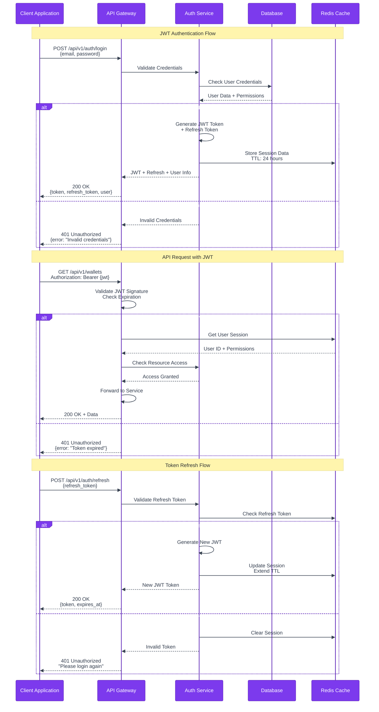
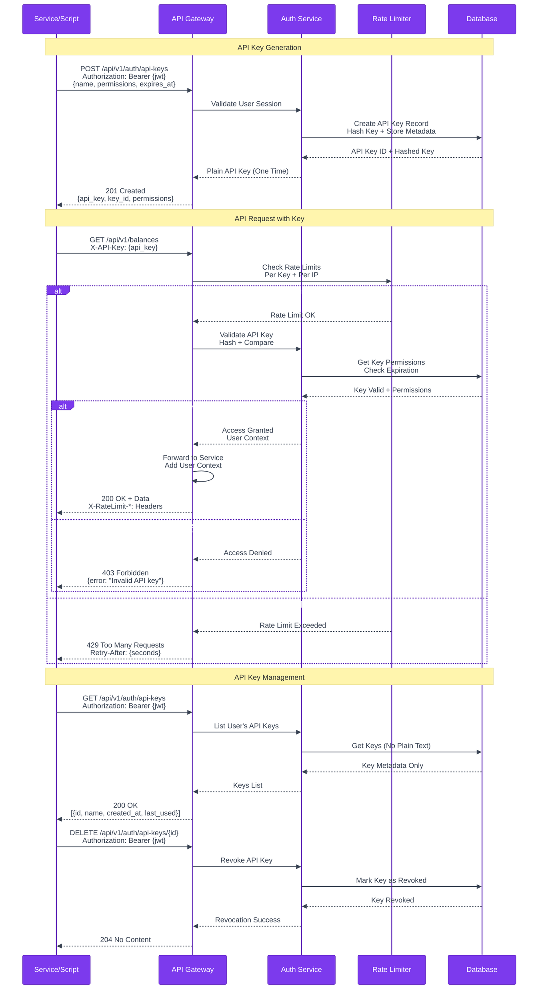
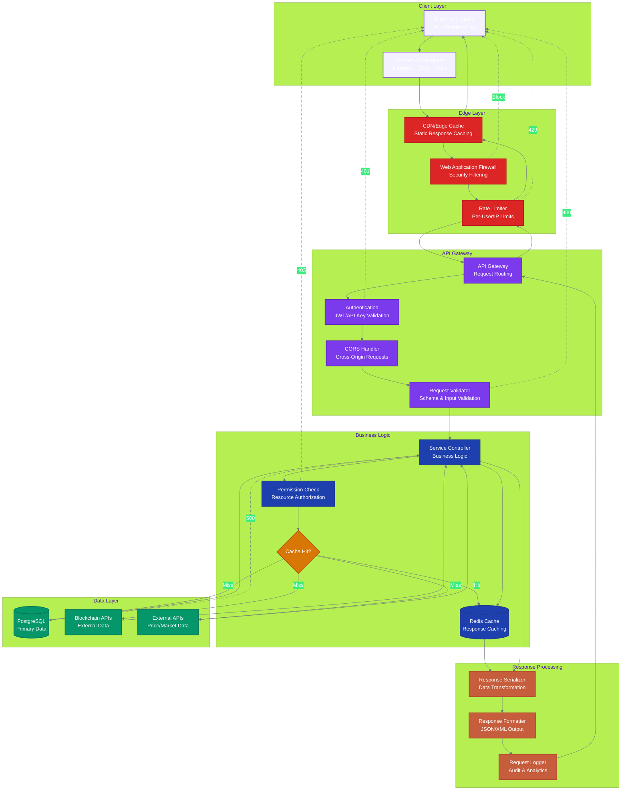

# Treasury Command Center API Documentation

Comprehensive API reference for Treasury Command Center's RESTful API.

## 🌐 API Overview

The Treasury Command Center API provides programmatic access to all platform features, enabling:
- Multi-chain treasury monitoring
- Real-time balance tracking
- Alert and notification management
- Analytics and reporting
- User and authentication management

### Base URL
```
Production: https://api.treasury-command-center.com
Development: http://localhost:8000
```

### API Version
Current Version: **v1**  
All endpoints are prefixed with `/api/v1/`

## 🔐 Authentication

Treasury Command Center uses JWT-based authentication with API keys for service-to-service communication.

### Authentication Methods

#### 1. JWT Authentication (Web Application)
```bash
# Login to get JWT token
POST /api/v1/auth/login
{
  "email": "user@example.com",
  "password": "password"
}

# Use token in subsequent requests
Authorization: Bearer <jwt_token>
```

#### 2. API Key Authentication (Programmatic Access)
```bash
# Use API key in header
X-API-Key: <your_api_key>
```

### Complete Authentication Flow



### API Key Authentication Flow



### Getting API Keys
1. Log in to Treasury Command Center
2. Navigate to "Settings" → "API Keys"
3. Generate new API key with appropriate permissions
4. Store securely and use in API requests

## 📚 Core Endpoints

### Authentication Endpoints
- `POST /api/v1/auth/register` - Register new user
- `POST /api/v1/auth/login` - User login
- `POST /api/v1/auth/refresh` - Refresh JWT token
- `POST /api/v1/auth/logout` - User logout
- `GET /api/v1/auth/me` - Get current user info

### Wallet Management
- `GET /api/v1/wallets` - List user wallets
- `POST /api/v1/wallets` - Add new wallet
- `GET /api/v1/wallets/{id}` - Get wallet details
- `PUT /api/v1/wallets/{id}` - Update wallet
- `DELETE /api/v1/wallets/{id}` - Remove wallet

### Balance Tracking
- `GET /api/v1/balances` - Get all balances
- `GET /api/v1/balances/{wallet_id}` - Get wallet balances
- `GET /api/v1/balances/history` - Balance history
- `POST /api/v1/balances/sync` - Force balance sync

### Analytics & Reporting
- `GET /api/v1/analytics/portfolio` - Portfolio analytics
- `GET /api/v1/analytics/performance` - Performance metrics
- `GET /api/v1/reports/summary` - Treasury summary
- `GET /api/v1/reports/export` - Export data

### Alerts & Notifications
- `GET /api/v1/alerts` - List alerts
- `POST /api/v1/alerts` - Create alert
- `PUT /api/v1/alerts/{id}` - Update alert
- `DELETE /api/v1/alerts/{id}` - Delete alert

## 📝 API Examples

### Add New Wallet
```bash
curl -X POST "http://localhost:8000/api/v1/wallets" \
  -H "X-API-Key: your_api_key" \
  -H "Content-Type: application/json" \
  -d '{
    "address": "0x742d35Cc6634C0532925a3b8D42C81Da2b78D8d9",
    "network": "ethereum",
    "label": "Main Treasury Wallet",
    "description": "Primary treasury wallet for operations"
  }'
```

### Get Portfolio Analytics
```bash
curl -X GET "http://localhost:8000/api/v1/analytics/portfolio" \
  -H "X-API-Key: your_api_key" \
  -H "Content-Type: application/json"
```

### Create Balance Alert
```bash
curl -X POST "http://localhost:8000/api/v1/alerts" \
  -H "X-API-Key: your_api_key" \
  -H "Content-Type: application/json" \
  -d '{
    "wallet_id": "wallet_123",
    "alert_type": "balance_threshold",
    "threshold": 1000000,
    "operator": "lt",
    "notification_methods": ["email", "slack"]
  }'
```

## 🔄 Complete API Request Lifecycle



## 📋 Request/Response Format

### Standard Response Format
```json
{
  "success": true,
  "data": {
    // Response data
  },
  "message": "Success message",
  "timestamp": "2025-07-17T14:00:00Z",
  "request_id": "req_123456"
}
```

### Error Response Format
```json
{
  "success": false,
  "error": {
    "code": "INVALID_REQUEST",
    "message": "Detailed error message",
    "details": {
      // Additional error context
    }
  },
  "timestamp": "2025-07-17T14:00:00Z",
  "request_id": "req_123456"
}
```

## 🔄 Rate Limiting

API requests are rate-limited to ensure fair usage:

- **Authenticated requests**: 1000 requests per hour
- **Unauthenticated requests**: 100 requests per hour
- **Burst limit**: 50 requests per minute

Rate limit headers:
```
X-RateLimit-Limit: 1000
X-RateLimit-Remaining: 999
X-RateLimit-Reset: 1642694400
```

## 📊 Supported Networks

Treasury Command Center supports the following blockchain networks:

| Network | Chain ID | Native Token | Status |
|---------|----------|--------------|--------|
| Ethereum | 1 | ETH | ✅ Active |
| Polygon | 137 | MATIC | ✅ Active |
| Arbitrum | 42161 | ETH | ✅ Active |
| Optimism | 10 | ETH | ✅ Active |
| Cardano | - | ADA | 🚧 Beta |
| Solana | - | SOL | 🚧 Beta |
| Bitcoin | - | BTC | 📋 Planned |

## 🛠️ SDK & Libraries

### Official SDKs
- **JavaScript/TypeScript**: `npm install @treasury-cc/sdk`
- **Python**: `pip install treasury-command-center`
- **Go**: Coming soon
- **Rust**: Community contribution welcome

### Example Usage (JavaScript)
```javascript
import { TreasuryCC } from '@treasury-cc/sdk';

const client = new TreasuryCC({
  apiKey: 'your_api_key',
  baseUrl: 'http://localhost:8000'
});

// Get portfolio analytics
const analytics = await client.analytics.getPortfolio();
console.log(analytics);
```

## 🧪 Testing

### Sandbox Environment
Use our sandbox environment for testing:
- **Base URL**: `https://sandbox-api.treasury-command-center.com`
- **Test API Keys**: Available in developer dashboard
- **Test Data**: Pre-populated wallets and transactions

### Postman Collection
Import our Postman collection for easy API testing:
```bash
curl -o treasury-cc-api.json https://api.treasury-command-center.com/postman
```

## 📖 Additional Resources

- **[WebSocket API](WEBSOCKET.md)** - Real-time data streams
- **[Webhook Guide](WEBHOOKS.md)** - Event notifications
- **[Error Codes](ERROR_CODES.md)** - Complete error reference
- **[Changelog](CHANGELOG.md)** - API version history
- **[Migration Guide](MIGRATION.md)** - Upgrading between versions

## 🤝 Support

- **API Issues**: [GitHub Issues](https://github.com/lamassu-labs/treasury-command-center/issues)
- **Discord**: [Developer Channel](https://discord.gg/treasury-command-center)
- **Email**: api-support@treasury-command-center.com

---

**Last Updated**: July 17, 2025  
**API Version**: v1.0.0