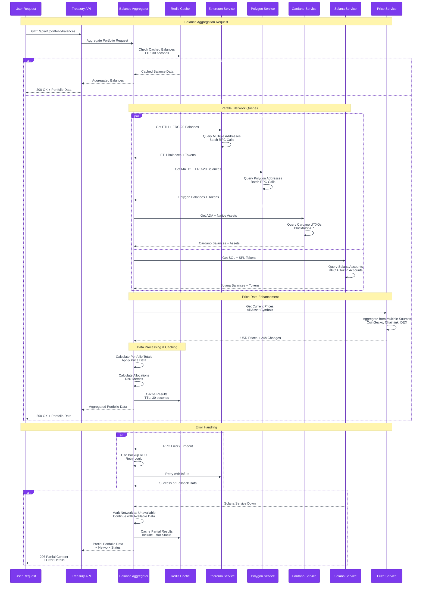
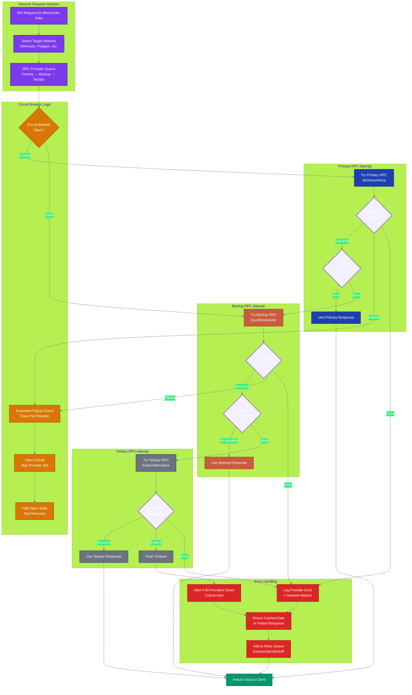

# Multi-Chain Blockchain Setup

Complete guide for configuring Treasury Command Center to work with multiple blockchain networks.

## 🌐 Supported Networks

Treasury Command Center provides comprehensive support for major blockchain networks:

### Tier 1 Networks (Full Support)
| Network | Chain ID | Native Token | RPC Endpoints | Status |
|---------|----------|--------------|---------------|--------|
| Ethereum | 1 | ETH | Alchemy, Infura, QuickNode | ✅ Production |
| Polygon | 137 | MATIC | Alchemy, QuickNode | ✅ Production |
| Arbitrum One | 42161 | ETH | Alchemy, Arbitrum RPC | ✅ Production |
| Optimism | 10 | ETH | Alchemy, Optimism RPC | ✅ Production |

### Tier 2 Networks (Beta Support)
| Network | Chain ID | Native Token | RPC Endpoints | Status |
|---------|----------|--------------|---------------|--------|
| Cardano | - | ADA | Blockfrost API | 🧪 Beta |
| Solana | - | SOL | Solana RPC, GenesysGo | 🧪 Beta |
| Avalanche | 43114 | AVAX | Avalanche RPC | 🧪 Beta |
| BNB Chain | 56 | BNB | BNB RPC, Ankr | 🧪 Beta |

### Tier 3 Networks (Planned)
| Network | Native Token | Expected Release | Status |
|---------|--------------|------------------|--------|
| Bitcoin | BTC | Q4 2025 | 📋 Planned |
| Cosmos | ATOM | Q1 2026 | 📋 Planned |
| Polkadot | DOT | Q1 2026 | 📋 Planned |
| Tezos | XTZ | Q2 2026 | 📋 Planned |

## 🏗️ Multi-Chain Architecture Overview

### Complete Multi-Chain Integration Architecture

```mermaid
%%{init: {
  'theme': 'base',
  'themeVariables': {
    'primaryColor': '#7C3AED',
    'primaryTextColor': '#FFFFFF',
    'primaryBorderColor': '#5B21B6',
    'lineColor': '#6B7280',
    'sectionColor': '#F3F0FF',
    'textColor': '#374151'
  }
}}%%
graph TB
    subgraph "Treasury Command Center Core"
        API[Treasury Management API]
        AGGREGATOR[Balance Aggregator Service]
        PRICE_ENGINE[Price Calculation Engine]
        ANALYTICS[Portfolio Analytics]
        ALERTS[Alert Management]
    end
    
    subgraph "EVM Networks (Production)"
        ETH[Ethereum Mainnet<br/>Native ETH + ERC-20]
        POLYGON[Polygon Network<br/>MATIC + ERC-20]
        ARB[Arbitrum One<br/>ETH + ERC-20]
        OPT[Optimism<br/>ETH + ERC-20]
        AVAX[Avalanche C-Chain<br/>AVAX + ERC-20]
        BSC[BNB Smart Chain<br/>BNB + BEP-20]
    end
    
    subgraph "Non-EVM Networks (Beta)"
        ADA[Cardano<br/>ADA + Native Assets]
        SOL[Solana<br/>SOL + SPL Tokens]
        DOT[Polkadot<br/>DOT + Parachain Assets]
        COSMOS[Cosmos Hub<br/>ATOM + IBC Tokens]
    end
    
    subgraph "UTXO Networks (Planned)"
        BTC[Bitcoin<br/>BTC + Lightning]
        LTC[Litecoin<br/>LTC + MWEB]
        BCH[Bitcoin Cash<br/>BCH + CashTokens]
    end
    
    subgraph "RPC Infrastructure"
        ALCHEMY[Alchemy<br/>Primary EVM Provider]
        INFURA[Infura<br/>Backup EVM Provider]
        QUICKNODE[QuickNode<br/>High Performance]
        ANKR[Ankr<br/>Decentralized RPC]
        BLOCKFROST[Blockfrost<br/>Cardano API]
        SOLANA_RPC[Solana RPC<br/>GenesysGo + Official]
    end
    
    subgraph "Data Sources"
        PRICE_FEEDS[Price Data APIs<br/>CoinGecko, Chainlink]
        INDEXERS[Blockchain Indexers<br/>The Graph, Covalent]
        DEX_APIS[DEX APIs<br/>Uniswap, PancakeSwap]
        DEFI_APIS[DeFi Protocol APIs<br/>Aave, Compound]
    end
    
    %% Core connections
    API --> AGGREGATOR
    AGGREGATOR --> PRICE_ENGINE
    PRICE_ENGINE --> ANALYTICS
    ANALYTICS --> ALERTS
    
    %% EVM network connections
    AGGREGATOR --> ETH
    AGGREGATOR --> POLYGON
    AGGREGATOR --> ARB
    AGGREGATOR --> OPT
    AGGREGATOR --> AVAX
    AGGREGATOR --> BSC
    
    %% Non-EVM connections
    AGGREGATOR --> ADA
    AGGREGATOR --> SOL
    AGGREGATOR --> DOT
    AGGREGATOR --> COSMOS
    
    %% Planned connections (dashed)
    AGGREGATOR -.-> BTC
    AGGREGATOR -.-> LTC
    AGGREGATOR -.-> BCH
    
    %% RPC provider connections
    ETH --> ALCHEMY
    ETH --> INFURA
    POLYGON --> QUICKNODE
    ARB --> ALCHEMY
    OPT --> ALCHEMY
    AVAX --> ANKR
    BSC --> ANKR
    
    ADA --> BLOCKFROST
    SOL --> SOLANA_RPC
    
    %% Data source connections
    PRICE_ENGINE --> PRICE_FEEDS
    ANALYTICS --> INDEXERS
    AGGREGATOR --> DEX_APIS
    ANALYTICS --> DEFI_APIS
    
    %% Styling
    classDef core fill:#7C3AED,color:#FFFFFF,stroke:#5B21B6,stroke-width:2px
    classDef evm fill:#1E40AF,color:#FFFFFF,stroke:#1E3A8A,stroke-width:2px
    classDef nonEvm fill:#C65D3C,color:#FFFFFF,stroke:#B5472A,stroke-width:2px
    classDef utxo fill:#6B7280,color:#FFFFFF,stroke:#4B5563,stroke-width:2px
    classDef infrastructure fill:#059669,color:#FFFFFF,stroke:#047857,stroke-width:2px
    classDef data fill:#D97706,color:#FFFFFF,stroke:#B45309,stroke-width:2px
    
    class API,AGGREGATOR,PRICE_ENGINE,ANALYTICS,ALERTS core
    class ETH,POLYGON,ARB,OPT,AVAX,BSC evm
    class ADA,SOL,DOT,COSMOS nonEvm
    class BTC,LTC,BCH utxo
    class ALCHEMY,INFURA,QUICKNODE,ANKR,BLOCKFROST,SOLANA_RPC infrastructure
    class PRICE_FEEDS,INDEXERS,DEX_APIS,DEFI_APIS data
```



### Cross-Chain Balance Aggregation Flow



### Network Failover Logic



### Price Aggregation Sources

```mermaid
%%{init: {
  'theme': 'base',
  'themeVariables': {
    'primaryColor': '#7C3AED',
    'primaryTextColor': '#FFFFFF',
    'primaryBorderColor': '#5B21B6',
    'lineColor': '#6B7280',
    'sectionColor': '#F3F0FF',
    'textColor': '#374151'
  }
}}%%
graph TB
    subgraph "Treasury Command Center"
        PRICE_ENGINE[Price Calculation Engine]
        AGGREGATOR[Price Aggregation Service]
        CACHE[Price Cache<br/>Redis + 30s TTL]
        VALIDATOR[Price Validation<br/>Outlier Detection]
    end
    
    subgraph "Centralized Price APIs"
        COINGECKO[CoinGecko API<br/>~8000 Tokens<br/>Primary Source]
        COINMARKETCAP[CoinMarketCap API<br/>~5000 Tokens<br/>Secondary Source]
        CRYPTOCOMPARE[CryptoCompare API<br/>~4000 Tokens<br/>Backup Source]
        NOMICS[Nomics API<br/>~3000 Tokens<br/>Legacy Support]
    end
    
    subgraph "Oracle Networks"
        CHAINLINK[Chainlink Price Feeds<br/>On-chain Oracles<br/>ETH, MATIC, AVAX]
        PYTH[Pyth Network<br/>High-Frequency Data<br/>SOL, FTT]
        BAND_PROTOCOL[Band Protocol<br/>Cross-chain Oracles<br/>Multi-network]
        UMA[UMA Protocol<br/>Optimistic Oracles<br/>Synthetic Assets]
    end
    
    subgraph "DEX Price Sources"
        UNISWAP_V3[Uniswap V3<br/>Ethereum Mainnet<br/>TWAP + Spot]
        SUSHISWAP[SushiSwap<br/>Multi-chain DEX<br/>ETH, POLYGON, AVAX]
        PANCAKESWAP[PancakeSwap<br/>BNB Smart Chain<br/>BSC Tokens]
        QUICKSWAP[QuickSwap<br/>Polygon Network<br/>MATIC Ecosystem]
        TRADER_JOE[Trader Joe<br/>Avalanche Network<br/>AVAX Ecosystem]
        RAYDIUM[Raydium<br/>Solana Network<br/>SOL + SPL Tokens]
    end
    
    subgraph "DeFi Protocol APIs"
        AAVE_API[Aave Protocol<br/>Lending Rates<br/>Multi-chain]
        COMPOUND_API[Compound Protocol<br/>Interest Rates<br/>Ethereum]
        CURVE_API[Curve Finance<br/>Stablecoin Pools<br/>Multi-chain]
        YEARN_API[Yearn Finance<br/>Vault Prices<br/>Ethereum + Polygon]
    end
    
    subgraph "Price Calculation Logic"
        WEIGHTED_AVG[Weighted Average<br/>Source Reliability Weight]
        MEDIAN_CALC[Median Calculation<br/>Outlier Resistance]
        CONFIDENCE_SCORE[Confidence Score<br/>Agreement Percentage]
        HISTORICAL_ANALYSIS[Historical Analysis<br/>Trend Detection]
    end
    
    subgraph "Quality Assurance"
        OUTLIER_DETECTION[Outlier Detection<br/>±15% from Median]
        STALENESS_CHECK[Staleness Check<br/>Max 5 min old]
        VOLUME_WEIGHT[Volume Weighting<br/>Liquidity Consideration]
        CIRCUIT_BREAKER[Circuit Breaker<br/>Extreme Price Movements]
    end
    
    %% Treasury Command Center connections
    PRICE_ENGINE --> AGGREGATOR
    AGGREGATOR --> CACHE
    AGGREGATOR --> VALIDATOR
    
    %% Centralized API connections
    AGGREGATOR --> COINGECKO
    AGGREGATOR --> COINMARKETCAP
    AGGREGATOR --> CRYPTOCOMPARE
    AGGREGATOR --> NOMICS
    
    %% Oracle network connections
    AGGREGATOR --> CHAINLINK
    AGGREGATOR --> PYTH
    AGGREGATOR --> BAND_PROTOCOL
    AGGREGATOR --> UMA
    
    %% DEX connections
    AGGREGATOR --> UNISWAP_V3
    AGGREGATOR --> SUSHISWAP
    AGGREGATOR --> PANCAKESWAP
    AGGREGATOR --> QUICKSWAP
    AGGREGATOR --> TRADER_JOE
    AGGREGATOR --> RAYDIUM
    
    %% DeFi protocol connections
    AGGREGATOR --> AAVE_API
    AGGREGATOR --> COMPOUND_API
    AGGREGATOR --> CURVE_API
    AGGREGATOR --> YEARN_API
    
    %% Price calculation flow
    VALIDATOR --> WEIGHTED_AVG
    VALIDATOR --> MEDIAN_CALC
    VALIDATOR --> CONFIDENCE_SCORE
    VALIDATOR --> HISTORICAL_ANALYSIS
    
    %% Quality assurance flow
    WEIGHTED_AVG --> OUTLIER_DETECTION
    MEDIAN_CALC --> STALENESS_CHECK
    CONFIDENCE_SCORE --> VOLUME_WEIGHT
    HISTORICAL_ANALYSIS --> CIRCUIT_BREAKER
    
    %% Final price output
    OUTLIER_DETECTION --> PRICE_ENGINE
    STALENESS_CHECK --> PRICE_ENGINE
    VOLUME_WEIGHT --> PRICE_ENGINE
    CIRCUIT_BREAKER --> PRICE_ENGINE
    
    %% Cache feedback loop
    PRICE_ENGINE --> CACHE
    
    %% Styling
    classDef core fill:#7C3AED,color:#FFFFFF,stroke:#5B21B6,stroke-width:2px
    classDef centralized fill:#1E40AF,color:#FFFFFF,stroke:#1E3A8A,stroke-width:2px
    classDef oracle fill:#C65D3C,color:#FFFFFF,stroke:#B5472A,stroke-width:2px
    classDef dex fill:#059669,color:#FFFFFF,stroke:#047857,stroke-width:2px
    classDef defi fill:#D97706,color:#FFFFFF,stroke:#B45309,stroke-width:2px
    classDef calculation fill:#6B7280,color:#FFFFFF,stroke:#4B5563,stroke-width:2px
    classDef quality fill:#DC2626,color:#FFFFFF,stroke:#B91C1C,stroke-width:2px
    
    class PRICE_ENGINE,AGGREGATOR,CACHE,VALIDATOR core
    class COINGECKO,COINMARKETCAP,CRYPTOCOMPARE,NOMICS centralized
    class CHAINLINK,PYTH,BAND_PROTOCOL,UMA oracle
    class UNISWAP_V3,SUSHISWAP,PANCAKESWAP,QUICKSWAP,TRADER_JOE,RAYDIUM dex
    class AAVE_API,COMPOUND_API,CURVE_API,YEARN_API defi
    class WEIGHTED_AVG,MEDIAN_CALC,CONFIDENCE_SCORE,HISTORICAL_ANALYSIS calculation
    class OUTLIER_DETECTION,STALENESS_CHECK,VOLUME_WEIGHT,CIRCUIT_BREAKER quality
```



## ⚙️ Network Configuration

### 1. Environment Setup

#### Ethereum Mainnet
```bash
# Primary RPC endpoint (required)
ETHEREUM_RPC_URL=https://eth-mainnet.g.alchemy.com/v2/YOUR_API_KEY

# WebSocket endpoint for real-time updates (optional)
ETHEREUM_WSS_URL=wss://eth-mainnet.g.alchemy.com/v2/YOUR_API_KEY

# Archive node for historical data (optional)
ETHEREUM_ARCHIVE_URL=https://eth-mainnet.g.alchemy.com/v2/YOUR_API_KEY

# Backup RPC endpoints
ETHEREUM_RPC_BACKUP_1=https://mainnet.infura.io/v3/YOUR_PROJECT_ID
ETHEREUM_RPC_BACKUP_2=https://rpc.ankr.com/eth
```

#### Polygon
```bash
POLYGON_RPC_URL=https://polygon-mainnet.g.alchemy.com/v2/YOUR_API_KEY
POLYGON_WSS_URL=wss://polygon-mainnet.g.alchemy.com/v2/YOUR_API_KEY
POLYGON_RPC_BACKUP_1=https://polygon-rpc.com
POLYGON_RPC_BACKUP_2=https://rpc.ankr.com/polygon
```

#### Arbitrum One
```bash
ARBITRUM_RPC_URL=https://arb-mainnet.g.alchemy.com/v2/YOUR_API_KEY
ARBITRUM_WSS_URL=wss://arb-mainnet.g.alchemy.com/v2/YOUR_API_KEY
ARBITRUM_RPC_BACKUP_1=https://arb1.arbitrum.io/rpc
ARBITRUM_RPC_BACKUP_2=https://rpc.ankr.com/arbitrum
```

#### Optimism
```bash
OPTIMISM_RPC_URL=https://opt-mainnet.g.alchemy.com/v2/YOUR_API_KEY
OPTIMISM_WSS_URL=wss://opt-mainnet.g.alchemy.com/v2/YOUR_API_KEY
OPTIMISM_RPC_BACKUP_1=https://mainnet.optimism.io
OPTIMISM_RPC_BACKUP_2=https://rpc.ankr.com/optimism
```

### 2. Non-EVM Networks

#### Cardano
```bash
# Blockfrost API configuration
CARDANO_NETWORK=mainnet
BLOCKFROST_PROJECT_ID=mainnetXXXXXXXXXXXXXXXX
BLOCKFROST_API_URL=https://cardano-mainnet.blockfrost.io/api/v0

# Backup providers
CARDANO_RPC_BACKUP_1=https://cardano-mainnet.blockfrost.io/api/v0
```

#### Solana
```bash
# Primary RPC endpoint
SOLANA_RPC_URL=https://api.mainnet-beta.solana.com
SOLANA_WSS_URL=wss://api.mainnet-beta.solana.com

# GenesysGo endpoints
SOLANA_RPC_BACKUP_1=https://ssc-dao.genesysgo.net
SOLANA_WSS_BACKUP_1=wss://ssc-dao.genesysgo.net

# Commitment level for transactions
SOLANA_COMMITMENT=confirmed
```

## 🔧 Advanced Configuration

### Rate Limiting Configuration
```bash
# Per-network rate limits (requests per second)
ETHEREUM_RATE_LIMIT=10
POLYGON_RATE_LIMIT=15
ARBITRUM_RATE_LIMIT=10
OPTIMISM_RATE_LIMIT=10
CARDANO_RATE_LIMIT=5
SOLANA_RATE_LIMIT=20

# Burst limits for short periods
ETHEREUM_BURST_LIMIT=50
POLYGON_BURST_LIMIT=75
```

### Connection Pooling
```bash
# Maximum concurrent connections per network
ETHEREUM_MAX_CONNECTIONS=10
POLYGON_MAX_CONNECTIONS=8
ARBITRUM_MAX_CONNECTIONS=6
OPTIMISM_MAX_CONNECTIONS=6

# Connection timeout settings (milliseconds)
RPC_TIMEOUT=30000
WS_TIMEOUT=60000
```

### Retry Configuration
```bash
# Retry attempts for failed requests
MAX_RETRY_ATTEMPTS=3
RETRY_DELAY_MS=1000
EXPONENTIAL_BACKOFF=true

# Circuit breaker settings
CIRCUIT_BREAKER_ENABLED=true
FAILURE_THRESHOLD=5
RECOVERY_TIMEOUT=30000
```

## 🏗️ Network-Specific Setup

### Ethereum Ecosystem (EVM)

#### Smart Contract Integration
```typescript
// src/services/ethereum/contracts.ts
export const SUPPORTED_TOKENS = {
  ethereum: {
    USDC: '0xA0b86a33E6441D45f8B54BBF8f3F5E2d7E5F1A2A',
    USDT: '0xdAC17F958D2ee523a2206206994597C13D831ec7',
    DAI: '0x6B175474E89094C44Da98b954EedeAC495271d0F',
    WETH: '0xC02aaA39b223FE8D0A0e5C4F27eAD9083C756Cc2'
  },
  polygon: {
    USDC: '0x2791Bca1f2de4661ED88A30C99A7a9449Aa84174',
    USDT: '0xc2132D05D31c914a87C6611C10748AEb04B58e8F',
    DAI: '0x8f3Cf7ad23Cd3CaDbD9735AFf958023239c6A063',
    WMATIC: '0x0d500B1d8E8eF31E21C99d1Db9A6444d3ADf1270'
  }
};
```

#### Gas Price Optimization
```typescript
// src/services/ethereum/gasPrice.ts
interface GasConfig {
  strategy: 'fast' | 'standard' | 'slow';
  maxGasPrice: number;
  gasLimit: number;
}

export const GAS_CONFIGS: Record<string, GasConfig> = {
  ethereum: {
    strategy: 'standard',
    maxGasPrice: 100, // gwei
    gasLimit: 21000
  },
  polygon: {
    strategy: 'fast',
    maxGasPrice: 500, // gwei
    gasLimit: 21000
  }
};
```

### Cardano Integration

#### Address Format Validation
```typescript
// src/services/cardano/address.ts
import * as CardanoWasm from '@emurgo/cardano-serialization-lib-nodejs';

export function validateCardanoAddress(address: string): boolean {
  try {
    const addr = CardanoWasm.Address.from_bech32(address);
    return addr !== null;
  } catch {
    return false;
  }
}
```

#### UTXO Management
```typescript
// src/services/cardano/utxo.ts
interface CardanoUTXO {
  txHash: string;
  outputIndex: number;
  amount: string;
  assets: Array<{
    policyId: string;
    assetName: string;
    quantity: string;
  }>;
}

export async function getUTXOs(address: string): Promise<CardanoUTXO[]> {
  const response = await fetch(`${process.env.BLOCKFROST_API_URL}/addresses/${address}/utxos`, {
    headers: {
      'project_id': process.env.BLOCKFROST_PROJECT_ID!
    }
  });
  return response.json();
}
```

### Solana Integration

#### Account Validation
```typescript
// src/services/solana/account.ts
import { PublicKey } from '@solana/web3.js';

export function validateSolanaAddress(address: string): boolean {
  try {
    new PublicKey(address);
    return true;
  } catch {
    return false;
  }
}
```

#### Token Account Handling
```typescript
// src/services/solana/tokens.ts
import { TOKEN_PROGRAM_ID } from '@solana/spl-token';

export async function getSPLTokenAccounts(ownerAddress: string) {
  const connection = new Connection(process.env.SOLANA_RPC_URL!);
  const publicKey = new PublicKey(ownerAddress);
  
  const tokenAccounts = await connection.getParsedTokenAccountsByOwner(
    publicKey,
    { programId: TOKEN_PROGRAM_ID }
  );
  
  return tokenAccounts.value.map(account => ({
    mint: account.account.data.parsed.info.mint,
    amount: account.account.data.parsed.info.tokenAmount.uiAmount
  }));
}
```

## 🔄 Multi-Chain Balance Aggregation

### Balance Service Architecture
```typescript
// src/services/balance/aggregator.ts
interface NetworkBalance {
  network: string;
  nativeBalance: string;
  tokens: Array<{
    address: string;
    symbol: string;
    balance: string;
    decimals: number;
    usdValue?: number;
  }>;
}

export class MultiChainBalanceAggregator {
  async getPortfolioBalance(wallets: WalletConfig[]): Promise<NetworkBalance[]> {
    const balancePromises = wallets.map(wallet => 
      this.getNetworkBalance(wallet.network, wallet.address)
    );
    
    return Promise.all(balancePromises);
  }
  
  private async getNetworkBalance(network: string, address: string): Promise<NetworkBalance> {
    switch (network) {
      case 'ethereum':
        return this.getEthereumBalance(address);
      case 'cardano':
        return this.getCardanoBalance(address);
      case 'solana':
        return this.getSolanaBalance(address);
      default:
        throw new Error(`Unsupported network: ${network}`);
    }
  }
}
```

### Cross-Chain Price Aggregation
```typescript
// src/services/price/aggregator.ts
interface PriceData {
  symbol: string;
  price: number;
  change24h: number;
  source: string;
  timestamp: number;
}

export class PriceAggregator {
  private sources = ['coingecko', 'chainlink', 'pyth'];
  
  async getTokenPrice(symbol: string, network?: string): Promise<PriceData> {
    // Implement price aggregation logic
    const prices = await Promise.all(
      this.sources.map(source => this.fetchPrice(source, symbol))
    );
    
    return this.aggregatePrices(prices);
  }
}
```

## 🧪 Testing Multi-Chain Setup

### Network Connection Tests
```bash
# Test Ethereum connection
curl -X POST \
  -H "Content-Type: application/json" \
  -d '{"jsonrpc":"2.0","method":"eth_blockNumber","params":[],"id":1}' \
  $ETHEREUM_RPC_URL

# Test Cardano connection
curl -H "project_id: $BLOCKFROST_PROJECT_ID" \
  $BLOCKFROST_API_URL/health

# Test Solana connection
curl -X POST \
  -H "Content-Type: application/json" \
  -d '{"jsonrpc":"2.0","id":1,"method":"getSlot"}' \
  $SOLANA_RPC_URL
```

### Integration Tests
```typescript
// tests/integration/multichain.test.ts
describe('Multi-Chain Integration', () => {
  test('should connect to all configured networks', async () => {
    const networks = ['ethereum', 'polygon', 'arbitrum', 'optimism'];
    
    for (const network of networks) {
      const health = await checkNetworkHealth(network);
      expect(health.connected).toBe(true);
      expect(health.latency).toBeLessThan(5000);
    }
  });
  
  test('should aggregate balances across networks', async () => {
    const wallets = [
      { network: 'ethereum', address: '0x...' },
      { network: 'polygon', address: '0x...' }
    ];
    
    const aggregator = new MultiChainBalanceAggregator();
    const balances = await aggregator.getPortfolioBalance(wallets);
    
    expect(balances).toHaveLength(2);
    expect(balances[0].network).toBe('ethereum');
    expect(balances[1].network).toBe('polygon');
  });
});
```

## 🔧 Troubleshooting

### Common Issues

#### RPC Endpoint Issues
```bash
# Check endpoint accessibility
curl -I $ETHEREUM_RPC_URL

# Test with different method
curl -X POST \
  -H "Content-Type: application/json" \
  -d '{"jsonrpc":"2.0","method":"net_version","params":[],"id":1}' \
  $ETHEREUM_RPC_URL
```

#### Rate Limiting
```bash
# Monitor rate limits in logs
tail -f logs/network-errors.log | grep "rate limit"

# Adjust rate limits in configuration
echo "ETHEREUM_RATE_LIMIT=5" >> .env
```

#### Connection Timeouts
```bash
# Increase timeout values
RPC_TIMEOUT=60000
WS_TIMEOUT=120000

# Use backup endpoints
ETHEREUM_RPC_BACKUP_1=https://rpc.ankr.com/eth
```

### Performance Optimization

#### Connection Pooling
```typescript
// src/services/connection/pool.ts
export class ConnectionPool {
  private pools: Map<string, Connection[]> = new Map();
  
  async getConnection(network: string): Promise<Connection> {
    const pool = this.pools.get(network) || [];
    
    if (pool.length > 0) {
      return pool.pop()!;
    }
    
    return this.createConnection(network);
  }
  
  releaseConnection(network: string, connection: Connection) {
    const pool = this.pools.get(network) || [];
    pool.push(connection);
    this.pools.set(network, pool);
  }
}
```

#### Caching Strategy
```typescript
// src/services/cache/multichain.ts
export class MultiChainCache {
  private redis: Redis;
  
  async cacheBalance(network: string, address: string, balance: any) {
    const key = `balance:${network}:${address}`;
    await this.redis.setex(key, 300, JSON.stringify(balance)); // 5-minute cache
  }
  
  async getCachedBalance(network: string, address: string) {
    const key = `balance:${network}:${address}`;
    const cached = await this.redis.get(key);
    return cached ? JSON.parse(cached) : null;
  }
}
```

## 📚 Additional Resources

- **[Network-Specific Guides](./networks/)** - Detailed setup for each network
- **[API Documentation](../api/)** - Multi-chain API endpoints
- **[Troubleshooting Guide](../getting-started/TROUBLESHOOTING.md)** - Common issues and solutions
- **[Performance Optimization](../deployment/PERFORMANCE.md)** - Scaling multi-chain operations

---

**Last Updated**: July 17, 2025  
**Supported Networks**: 8 (4 production, 4 beta)