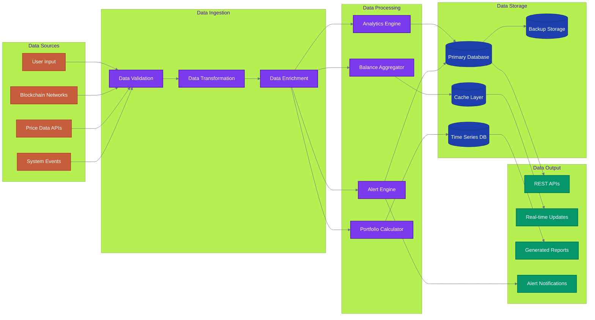
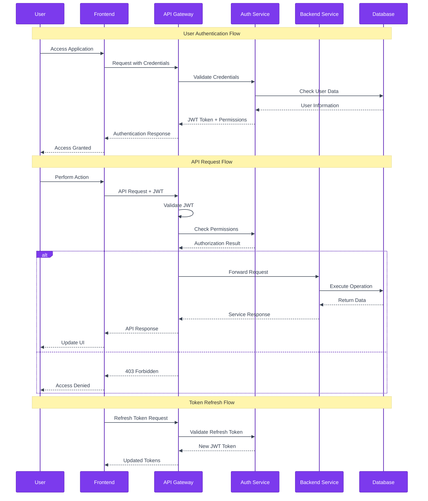
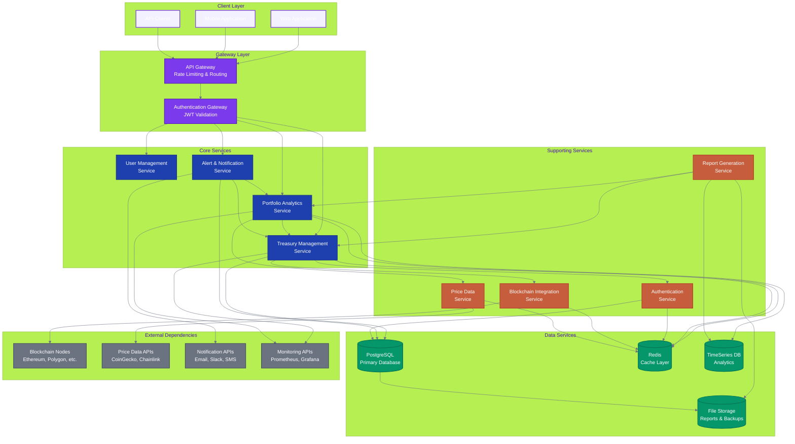

# Treasury Command Center - Technical Architecture Overview

**Document Type**: Technical Architecture  
**Version**: 1.0  
**Last Updated**: July 17, 2025  
**Owner**: Engineering Community  

## System Architecture Overview

### **Complete System Architecture**

```mermaid
%%{init: {
  'theme': 'base',
  'themeVariables': {
    'primaryColor': '#7C3AED',
    'primaryTextColor': '#FFFFFF',
    'primaryBorderColor': '#5B21B6',
    'lineColor': '#6B7280',
    'sectionColor': '#F3F0FF',
    'altSectionColor': '#FEF3E6',
    'gridColor': '#E5E7EB',
    'textColor': '#374151',
    'secondaryColor': '#1E40AF',
    'tertiaryColor': '#C65D3C'
  }
}}%%
graph TB
    subgraph "User Interface Layer"
        UI[Next.js 14 Application]
        Mobile[Mobile Responsive UI]
        Dashboard[Executive Dashboard]
        API_UI[API Documentation]
    end
    
    subgraph "API Gateway & Security"
        Gateway[API Gateway]
        Auth[Authentication Service]
        RateLimit[Rate Limiting]
        LoadBalancer[Load Balancer]
        SSL[SSL/TLS Termination]
    end
    
    subgraph "Core Services Layer"
        TreasuryAPI[Treasury Management API]
        PortfolioAPI[Portfolio Analytics API]
        BlockchainAPI[Blockchain Integration API]
        NotificationAPI[Alert & Notification API]
        ReportAPI[Reporting Service API]
        UserAPI[User Management API]
    end
    
    subgraph "Data & Cache Layer"
        PostgreSQL[(PostgreSQL<br/>Primary Database)]
        Redis[(Redis Cache<br/>Session & Rate Limiting)]
        TimeSeries[(Time Series DB<br/>Analytics Data)]
        FileStorage[(File Storage<br/>Reports & Exports)]
    end
    
    subgraph "External Blockchain Networks"
        EVM[EVM Networks<br/>Ethereum, Polygon, Arbitrum]
        Cardano[Cardano Network<br/>Blockfrost API]
        Solana[Solana Network<br/>RPC Nodes]
        Bitcoin[Bitcoin Network<br/>Future Integration]
    end
    
    subgraph "External Services"
        PriceAPI[Price Data APIs<br/>CoinGecko, Chainlink]
        EmailSVC[Email Service<br/>SendGrid]
        MonitorSVC[Monitoring<br/>Prometheus, Grafana]
    end
    
    %% User Interface connections
    UI --> Gateway
    Mobile --> Gateway
    Dashboard --> Gateway
    API_UI --> Gateway
    
    %% Gateway to security
    Gateway --> Auth
    Gateway --> RateLimit
    Gateway --> SSL
    
    %% Gateway to services
    Gateway --> TreasuryAPI
    Gateway --> PortfolioAPI
    Gateway --> BlockchainAPI
    Gateway --> NotificationAPI
    Gateway --> ReportAPI
    Gateway --> UserAPI
    
    %% Services to data layer
    TreasuryAPI --> PostgreSQL
    TreasuryAPI --> Redis
    PortfolioAPI --> PostgreSQL
    PortfolioAPI --> TimeSeries
    BlockchainAPI --> Redis
    NotificationAPI --> PostgreSQL
    ReportAPI --> FileStorage
    UserAPI --> PostgreSQL
    
    %% Blockchain connections
    BlockchainAPI --> EVM
    BlockchainAPI --> Cardano
    BlockchainAPI --> Solana
    BlockchainAPI --> Bitcoin
    
    %% External service connections
    PortfolioAPI --> PriceAPI
    NotificationAPI --> EmailSVC
    TreasuryAPI --> MonitorSVC
    
    %% Styling
    classDef frontend fill:#F3F0FF,stroke:#7C3AED,stroke-width:2px
    classDef api fill:#7C3AED,color:#FFFFFF,stroke:#5B21B6,stroke-width:2px
    classDef data fill:#1E40AF,color:#FFFFFF,stroke:#1E3A8A,stroke-width:2px
    classDef blockchain fill:#C65D3C,color:#FFFFFF,stroke:#B5472A,stroke-width:2px
    classDef external fill:#6B7280,color:#FFFFFF,stroke:#4B5563,stroke-width:2px
    
    class UI,Mobile,Dashboard,API_UI frontend
    class Gateway,Auth,RateLimit,LoadBalancer,SSL,TreasuryAPI,PortfolioAPI,BlockchainAPI,NotificationAPI,ReportAPI,UserAPI api
    class PostgreSQL,Redis,TimeSeries,FileStorage data
    class EVM,Cardano,Solana,Bitcoin blockchain
    class PriceAPI,EmailSVC,MonitorSVC external
```



### **Data Flow Architecture**



### **Authentication & Authorization Flow**



## Frontend Architecture

### **Technology Stack**
- **Framework**: Next.js 14 with App Router
- **UI Library**: React 18 + TypeScript 5
- **Styling**: Tailwind CSS 3 + Shadcn/UI components
- **State Management**: Zustand + React Query
- **Authentication**: Auth0 + Internet Identity + OAuth

### **Component Architecture**

```typescript
// Component Hierarchy
app/
├── (auth)/                 # Authentication layout group
│   ├── login/             # Login page
│   └── signup/            # Registration page
├── dashboard/             # Main enterprise dashboard
│   ├── overview/          # Executive overview
│   ├── alerts/            # Alert management
│   └── settings/          # User settings
├── portfolio/             # Multi-chain portfolio module
│   ├── assets/            # Asset management
│   ├── transactions/      # Transaction history
│   └── analytics/         # Portfolio analytics
├── stablecoins/          # Stablecoin management module
│   ├── holdings/          # Current positions
│   ├── stability/         # Stability monitoring
│   └── yield/             # Yield opportunities
├── automation/           # AI agent automation module
│   ├── agents/            # Agent management
│   ├── rules/             # Automation rules
│   └── insights/          # AI insights
├── analytics/            # Intelligence & analytics module
│   ├── reports/           # Report generation
│   ├── benchmarks/        # Performance benchmarks
│   └── intelligence/      # Market intelligence
└── api/                  # API routes
    ├── auth/              # Authentication endpoints
    ├── treasury/          # Treasury data endpoints
    ├── portfolio/         # Portfolio endpoints
    ├── alerts/            # Alert management
    └── webhooks/          # Real-time data webhooks
```

### **Design System Integration**

```typescript
// Shared Component Library
components/
├── ui/                    # Base UI components (Shadcn/UI)
│   ├── button.tsx
│   ├── card.tsx
│   ├── input.tsx
│   └── ...
├── treasury/             # Treasury-specific components
│   ├── balance-card.tsx
│   ├── transaction-list.tsx
│   ├── asset-chart.tsx
│   └── alert-panel.tsx
├── portfolio/            # Portfolio components
│   ├── portfolio-overview.tsx
│   ├── allocation-chart.tsx
│   └── performance-metrics.tsx
├── stablecoins/          # Stablecoin components
│   ├── stability-monitor.tsx
│   ├── reserve-tracker.tsx
│   └── yield-calculator.tsx
└── charts/               # Reusable chart components
    ├── line-chart.tsx
    ├── pie-chart.tsx
    └── candlestick-chart.tsx
```

### **Service Dependencies & Communication**



## Backend Architecture

### **Microservices Design**

```typescript
// Service Architecture
services/
├── auth-service/          # Authentication & authorization
│   ├── src/
│   │   ├── controllers/
│   │   ├── middleware/
│   │   ├── models/
│   │   └── routes/
│   ├── tests/
│   └── Dockerfile
├── treasury-service/      # Core treasury operations
│   ├── src/
│   │   ├── controllers/
│   │   ├── services/
│   │   ├── models/
│   │   └── blockchain/
│   ├── tests/
│   └── Dockerfile
├── portfolio-service/     # Multi-chain portfolio management
├── stablecoin-service/    # Stablecoin-specific logic
├── agent-service/         # AI agent management
├── analytics-service/     # Analytics & reporting
├── notification-service/  # Alert & notification system
└── api-gateway/          # Request routing & rate limiting
```

### **API Design Patterns**

```typescript
// RESTful API Structure
/api/v1/
├── auth/
│   ├── POST /login
│   ├── POST /logout
│   ├── POST /refresh
│   └── GET  /profile
├── treasury/
│   ├── GET    /accounts
│   ├── POST   /accounts
│   ├── GET    /accounts/:id/balance
│   └── GET    /accounts/:id/transactions
├── portfolio/
│   ├── GET    /positions
│   ├── GET    /performance
│   ├── GET    /analytics
│   └── POST   /rebalance
├── stablecoins/
│   ├── GET    /holdings
│   ├── GET    /stability-metrics
│   ├── GET    /yield-opportunities
│   └── POST   /alerts/stability
├── agents/
│   ├── GET    /agents
│   ├── POST   /agents
│   ├── PUT    /agents/:id
│   └── DELETE /agents/:id
└── analytics/
    ├── GET    /reports
    ├── POST   /reports/generate
    ├── GET    /benchmarks
    └── GET    /intelligence
```

## Database Architecture

### **PostgreSQL Schema Design**

```sql
-- Core organizational structure
CREATE TABLE organizations (
    id UUID PRIMARY KEY DEFAULT gen_random_uuid(),
    name VARCHAR(255) NOT NULL,
    plan VARCHAR(50) NOT NULL DEFAULT 'community',
    settings JSONB DEFAULT '{}',
    created_at TIMESTAMP DEFAULT NOW(),
    updated_at TIMESTAMP DEFAULT NOW()
);

-- Treasury account management
CREATE TABLE treasury_accounts (
    id UUID PRIMARY KEY DEFAULT gen_random_uuid(),
    organization_id UUID REFERENCES organizations(id),
    blockchain_network VARCHAR(50) NOT NULL,
    address VARCHAR(255) NOT NULL,
    account_type VARCHAR(50) NOT NULL,
    metadata JSONB DEFAULT '{}',
    is_active BOOLEAN DEFAULT true,
    created_at TIMESTAMP DEFAULT NOW(),
    updated_at TIMESTAMP DEFAULT NOW(),
    UNIQUE(blockchain_network, address)
);

-- Multi-chain portfolio positions
CREATE TABLE portfolio_positions (
    id UUID PRIMARY KEY DEFAULT gen_random_uuid(),
    account_id UUID REFERENCES treasury_accounts(id),
    asset_symbol VARCHAR(20) NOT NULL,
    asset_address VARCHAR(255),
    asset_type VARCHAR(50) NOT NULL, -- 'native', 'erc20', 'spl', 'native_cardano'
    balance DECIMAL(36, 18) NOT NULL,
    usd_value DECIMAL(18, 2),
    price_per_unit DECIMAL(18, 8),
    last_updated TIMESTAMP DEFAULT NOW(),
    INDEX idx_portfolio_account_asset (account_id, asset_symbol),
    INDEX idx_portfolio_updated (last_updated)
);

-- Transaction history
CREATE TABLE transactions (
    id UUID PRIMARY KEY DEFAULT gen_random_uuid(),
    account_id UUID REFERENCES treasury_accounts(id),
    transaction_hash VARCHAR(255) NOT NULL,
    block_number BIGINT,
    transaction_type VARCHAR(50) NOT NULL, -- 'send', 'receive', 'swap', 'stake'
    from_address VARCHAR(255),
    to_address VARCHAR(255),
    asset_symbol VARCHAR(20),
    amount DECIMAL(36, 18),
    usd_value DECIMAL(18, 2),
    gas_used DECIMAL(18, 8),
    gas_price DECIMAL(18, 8),
    status VARCHAR(20) DEFAULT 'confirmed',
    timestamp TIMESTAMP NOT NULL,
    metadata JSONB DEFAULT '{}',
    created_at TIMESTAMP DEFAULT NOW(),
    INDEX idx_transactions_account (account_id),
    INDEX idx_transactions_hash (transaction_hash),
    INDEX idx_transactions_timestamp (timestamp)
);

-- Stablecoin-specific data
CREATE TABLE stablecoin_reserves (
    id UUID PRIMARY KEY DEFAULT gen_random_uuid(),
    stablecoin_symbol VARCHAR(20) NOT NULL,
    blockchain_network VARCHAR(50) NOT NULL,
    contract_address VARCHAR(255),
    total_supply DECIMAL(36, 18),
    backing_assets JSONB, -- Array of reserve assets
    reserve_ratio DECIMAL(8, 4), -- Reserve backing percentage
    stability_metrics JSONB, -- Price stability data
    health_score DECIMAL(3, 2), -- Overall health (0-100)
    last_updated TIMESTAMP DEFAULT NOW(),
    INDEX idx_stablecoin_symbol (stablecoin_symbol),
    INDEX idx_stablecoin_network (blockchain_network)
);

-- AI agent configurations
CREATE TABLE ai_agents (
    id UUID PRIMARY KEY DEFAULT gen_random_uuid(),
    organization_id UUID REFERENCES organizations(id),
    name VARCHAR(255) NOT NULL,
    agent_type VARCHAR(50) NOT NULL, -- 'risk_monitor', 'compliance_checker', 'portfolio_optimizer'
    configuration JSONB NOT NULL,
    is_active BOOLEAN DEFAULT true,
    last_execution TIMESTAMP,
    execution_count INTEGER DEFAULT 0,
    created_at TIMESTAMP DEFAULT NOW(),
    updated_at TIMESTAMP DEFAULT NOW()
);

-- Alert system
CREATE TABLE alert_configurations (
    id UUID PRIMARY KEY DEFAULT gen_random_uuid(),
    organization_id UUID REFERENCES organizations(id),
    name VARCHAR(255) NOT NULL,
    alert_type VARCHAR(50) NOT NULL,
    conditions JSONB NOT NULL, -- Alert triggering conditions
    notification_channels JSONB NOT NULL, -- email, slack, sms, etc.
    is_active BOOLEAN DEFAULT true,
    created_at TIMESTAMP DEFAULT NOW(),
    updated_at TIMESTAMP DEFAULT NOW()
);

CREATE TABLE alert_instances (
    id UUID PRIMARY KEY DEFAULT gen_random_uuid(),
    configuration_id UUID REFERENCES alert_configurations(id),
    severity VARCHAR(20) NOT NULL, -- 'low', 'medium', 'high', 'critical'
    title VARCHAR(255) NOT NULL,
    message TEXT NOT NULL,
    data JSONB, -- Alert-specific data
    status VARCHAR(20) DEFAULT 'active', -- 'active', 'acknowledged', 'resolved'
    triggered_at TIMESTAMP DEFAULT NOW(),
    acknowledged_at TIMESTAMP,
    resolved_at TIMESTAMP
);

-- Compliance and reporting
CREATE TABLE compliance_reports (
    id UUID PRIMARY KEY DEFAULT gen_random_uuid(),
    organization_id UUID REFERENCES organizations(id),
    report_type VARCHAR(50) NOT NULL,
    period_start DATE NOT NULL,
    period_end DATE NOT NULL,
    data JSONB NOT NULL,
    generated_by UUID, -- User ID
    generated_at TIMESTAMP DEFAULT NOW(),
    status VARCHAR(20) DEFAULT 'generated' -- 'generated', 'reviewed', 'submitted'
);
```

### **Redis Cache Strategy**

```typescript
// Cache Layer Design
cache_keys = {
  // Real-time data (30 second TTL)
  portfolio_balance: "portfolio:balance:{organization_id}",
  asset_prices: "prices:{asset_symbol}",
  network_status: "network:{blockchain_network}:status",
  
  // Medium-term data (5 minute TTL)
  transaction_history: "transactions:{account_id}:page:{page}",
  portfolio_analytics: "portfolio:analytics:{organization_id}",
  stablecoin_metrics: "stablecoin:metrics:{symbol}",
  
  // Long-term data (1 hour TTL)
  historical_prices: "prices:historical:{asset_symbol}:{timeframe}",
  compliance_data: "compliance:{organization_id}:{report_type}",
  ai_insights: "ai:insights:{organization_id}:{date}"
}
```

## Blockchain Integration Architecture

### **Multi-Chain Connection Strategy**

```typescript
// Blockchain Service Interface
interface BlockchainService {
  network: string;
  getBalance(address: string): Promise<Balance[]>;
  getTransactions(address: string, options?: PaginationOptions): Promise<Transaction[]>;
  subscribeToAddress(address: string, callback: (tx: Transaction) => void): void;
  estimateGas(transaction: TransactionRequest): Promise<GasEstimate>;
  broadcastTransaction(signedTx: string): Promise<TransactionResult>;
}

// Network-specific implementations
class EthereumService implements BlockchainService {
  private web3: Web3;
  private wsProvider: WebSocketProvider;
  
  constructor(config: EthereumConfig) {
    this.web3 = new Web3(config.httpRpc);
    this.wsProvider = new WebSocketProvider(config.wsRpc);
  }
  
  async getBalance(address: string): Promise<Balance[]> {
    // Implementation for Ethereum balance fetching
  }
  
  // ... other methods
}

class CardanoService implements BlockchainService {
  private blockfrost: BlockfrostAPI;
  
  constructor(config: CardanoConfig) {
    this.blockfrost = new BlockfrostAPI(config);
  }
  
  // Cardano-specific implementation
}

// Service registry
class BlockchainServiceRegistry {
  private services: Map<string, BlockchainService> = new Map();
  
  register(network: string, service: BlockchainService) {
    this.services.set(network, service);
  }
  
  get(network: string): BlockchainService {
    const service = this.services.get(network);
    if (!service) throw new Error(`Unsupported network: ${network}`);
    return service;
  }
}
```

### **Real-time Data Streaming**

```typescript
// WebSocket Event System
class TreasuryEventStreamer {
  private websocket: WebSocketServer;
  private subscribers: Map<string, Set<WebSocket>> = new Map();
  
  // Subscribe client to organization events
  subscribe(organizationId: string, client: WebSocket) {
    if (!this.subscribers.has(organizationId)) {
      this.subscribers.set(organizationId, new Set());
    }
    this.subscribers.get(organizationId)!.add(client);
  }
  
  // Broadcast event to organization subscribers
  broadcast(organizationId: string, event: TreasuryEvent) {
    const clients = this.subscribers.get(organizationId);
    if (clients) {
      const payload = JSON.stringify(event);
      clients.forEach(client => {
        if (client.readyState === WebSocket.OPEN) {
          client.send(payload);
        }
      });
    }
  }
  
  // Handle new transaction detection
  onNewTransaction(transaction: Transaction) {
    const event: TreasuryEvent = {
      type: 'transaction',
      data: transaction,
      timestamp: new Date().toISOString()
    };
    
    this.broadcast(transaction.organizationId, event);
  }
}
```

## Security Architecture

### **Authentication & Authorization**

```typescript
// Multi-provider authentication
class AuthenticationService {
  private providers: Map<string, AuthProvider> = new Map();
  
  constructor() {
    this.providers.set('internet_identity', new InternetIdentityProvider());
    this.providers.set('oauth', new OAuth2Provider());
    this.providers.set('enterprise_sso', new EnterpriseSSO());
  }
  
  async authenticate(provider: string, credentials: any): Promise<AuthResult> {
    const authProvider = this.providers.get(provider);
    if (!authProvider) throw new Error(`Unsupported provider: ${provider}`);
    
    return await authProvider.authenticate(credentials);
  }
}

// Role-based access control
enum Permission {
  READ_TREASURY = 'treasury:read',
  WRITE_TREASURY = 'treasury:write',
  READ_PORTFOLIO = 'portfolio:read',
  WRITE_PORTFOLIO = 'portfolio:write',
  MANAGE_ALERTS = 'alerts:manage',
  VIEW_ANALYTICS = 'analytics:view',
  GENERATE_REPORTS = 'reports:generate',
  ADMIN_ACCESS = 'admin:all'
}

class AuthorizationService {
  checkPermission(user: User, permission: Permission, resource?: string): boolean {
    // Implementation of RBAC logic
    return user.roles.some(role => 
      role.permissions.includes(permission) &&
      this.checkResourceAccess(role, resource)
    );
  }
}
```

### **Data Security**

```typescript
// Encryption service
class EncryptionService {
  private readonly algorithm = 'aes-256-gcm';
  private readonly keyDerivation = 'pbkdf2';
  
  encrypt(data: string, organizationKey: string): EncryptedData {
    const iv = crypto.randomBytes(16);
    const salt = crypto.randomBytes(32);
    const key = crypto.pbkdf2Sync(organizationKey, salt, 100000, 32, 'sha256');
    
    const cipher = crypto.createCipher(this.algorithm, key, iv);
    let encrypted = cipher.update(data, 'utf8', 'hex');
    encrypted += cipher.final('hex');
    
    return {
      encrypted,
      iv: iv.toString('hex'),
      salt: salt.toString('hex'),
      tag: cipher.getAuthTag().toString('hex')
    };
  }
  
  decrypt(encryptedData: EncryptedData, organizationKey: string): string {
    // Decryption implementation
  }
}
```

## Performance Optimization

### **Caching Strategy**

```typescript
// Multi-level caching
class CacheManager {
  private redis: Redis;
  private memoryCache: LRUCache<string, any>;
  
  constructor() {
    this.redis = new Redis(process.env.REDIS_URL);
    this.memoryCache = new LRUCache({ max: 1000, ttl: 60000 }); // 1 minute
  }
  
  async get(key: string): Promise<any> {
    // L1: Memory cache
    let value = this.memoryCache.get(key);
    if (value) return value;
    
    // L2: Redis cache
    value = await this.redis.get(key);
    if (value) {
      const parsed = JSON.parse(value);
      this.memoryCache.set(key, parsed);
      return parsed;
    }
    
    return null;
  }
  
  async set(key: string, value: any, ttl: number): Promise<void> {
    this.memoryCache.set(key, value);
    await this.redis.setex(key, ttl, JSON.stringify(value));
  }
}
```

### **Database Optimization**

```sql
-- Performance indexes
CREATE INDEX CONCURRENTLY idx_portfolio_positions_account_asset ON portfolio_positions(account_id, asset_symbol);
CREATE INDEX CONCURRENTLY idx_transactions_account_timestamp ON transactions(account_id, timestamp DESC);
CREATE INDEX CONCURRENTLY idx_transactions_hash ON transactions(transaction_hash);
CREATE INDEX CONCURRENTLY idx_alert_instances_status_triggered ON alert_instances(status, triggered_at DESC);

-- Partitioning for large tables
CREATE TABLE transactions_y2025m01 PARTITION OF transactions
FOR VALUES FROM ('2025-01-01') TO ('2025-02-01');

-- Materialized views for analytics
CREATE MATERIALIZED VIEW portfolio_daily_snapshots AS
SELECT 
    account_id,
    DATE(last_updated) as snapshot_date,
    asset_symbol,
    SUM(balance) as total_balance,
    SUM(usd_value) as total_usd_value
FROM portfolio_positions
GROUP BY account_id, DATE(last_updated), asset_symbol;

CREATE UNIQUE INDEX ON portfolio_daily_snapshots(account_id, snapshot_date, asset_symbol);
```

## Monitoring & Observability

### **Application Monitoring**

```typescript
// Metrics collection
class MetricsCollector {
  private prometheus: PrometheusRegistry;
  
  constructor() {
    this.prometheus = new PrometheusRegistry();
    this.setupMetrics();
  }
  
  private setupMetrics() {
    // API response time
    this.apiResponseTime = new prometheus.Histogram({
      name: 'api_response_time_seconds',
      help: 'API response time in seconds',
      labelNames: ['method', 'route', 'status_code'],
      buckets: [0.1, 0.5, 1, 2, 5]
    });
    
    // Database query performance
    this.dbQueryTime = new prometheus.Histogram({
      name: 'db_query_time_seconds',
      help: 'Database query time in seconds',
      labelNames: ['query_type', 'table'],
      buckets: [0.01, 0.05, 0.1, 0.5, 1]
    });
    
    // Blockchain connection health
    this.blockchainHealth = new prometheus.Gauge({
      name: 'blockchain_connection_healthy',
      help: 'Blockchain connection health status',
      labelNames: ['network']
    });
  }
}
```

### **Error Tracking**

```typescript
// Centralized error handling
class ErrorTracker {
  private sentry: Sentry;
  private logger: Logger;
  
  trackError(error: Error, context: ErrorContext) {
    // Log to structured logging
    this.logger.error('Application error', {
      error: error.message,
      stack: error.stack,
      context,
      timestamp: new Date().toISOString()
    });
    
    // Send to Sentry for alerting
    this.sentry.captureException(error, {
      tags: context.tags,
      extra: context.extra,
      user: context.user
    });
  }
}
```

## Deployment Architecture

### **Container Strategy**

```dockerfile
# Multi-stage Docker build
FROM node:18-alpine AS builder
WORKDIR /app
COPY package*.json ./
RUN npm ci --only=production

FROM node:18-alpine AS runner
WORKDIR /app
RUN addgroup -g 1001 -S nodejs
RUN adduser -S nextjs -u 1001
COPY --from=builder /app/node_modules ./node_modules
COPY --from=builder --chown=nextjs:nodejs /app/.next ./.next
USER nextjs
EXPOSE 3000
CMD ["npm", "start"]
```

### **Kubernetes Deployment**

```yaml
# Kubernetes deployment
apiVersion: apps/v1
kind: Deployment
metadata:
  name: treasury-command-center
spec:
  replicas: 3
  selector:
    matchLabels:
      app: treasury-command-center
  template:
    metadata:
      labels:
        app: treasury-command-center
    spec:
      containers:
      - name: app
        image: treasury-command-center:latest
        ports:
        - containerPort: 3000
        env:
        - name: DATABASE_URL
          valueFrom:
            secretKeyRef:
              name: database-secret
              key: url
        resources:
          requests:
            memory: "256Mi"
            cpu: "250m"
          limits:
            memory: "512Mi"
            cpu: "500m"
        livenessProbe:
          httpGet:
            path: /api/health
            port: 3000
          initialDelaySeconds: 30
          periodSeconds: 10
        readinessProbe:
          httpGet:
            path: /api/ready
            port: 3000
          initialDelaySeconds: 5
          periodSeconds: 5
```

## Self-Hosting & Deployment Options

### **Docker Compose Deployment**

```yaml
# docker-compose.yml
version: '3.8'
services:
  app:
    build: .
    ports:
      - "3000:3000"
    environment:
      - DATABASE_URL=postgresql://postgres:password@db:5432/treasury
      - REDIS_URL=redis://redis:6379
    depends_on:
      - db
      - redis
  
  db:
    image: postgres:15
    environment:
      - POSTGRES_DB=treasury
      - POSTGRES_USER=postgres
      - POSTGRES_PASSWORD=password
    volumes:
      - postgres_data:/var/lib/postgresql/data
  
  redis:
    image: redis:7-alpine
    volumes:
      - redis_data:/data

volumes:
  postgres_data:
  redis_data:
```

### **Self-Hosting Guide**

```bash
# Quick self-hosting setup
git clone https://github.com/treasury-command-center/treasury-command-center.git
cd treasury-command-center

# Configure environment
cp .env.example .env
# Edit .env with your configuration

# Start with Docker Compose
docker-compose up -d

# Or install dependencies locally
npm install
npm run build
npm start
```

## Conclusion

This architecture provides a robust, scalable, and secure foundation for the Treasury Command Center that can:

1. **Handle Enterprise Scale**: Support 1000+ concurrent users and millions of transactions
2. **Maintain High Availability**: 99.9% uptime with automated failover
3. **Ensure Security**: Enterprise-grade security with encryption and access controls
4. **Enable Real-time Operations**: Sub-second data updates and real-time notifications
5. **Support Multi-chain Integration**: Seamless operation across 6+ blockchain networks
6. **Facilitate Self-Hosting**: Complete control over deployment and data

The modular, open-source design allows for community contributions and customization while maintaining system integrity and performance standards required for enterprise treasury management.

---

**Next Steps:**
1. Set up development environment following this architecture
2. Begin implementation with core treasury service
3. Implement monitoring and observability tools
4. Create comprehensive deployment documentation for the community