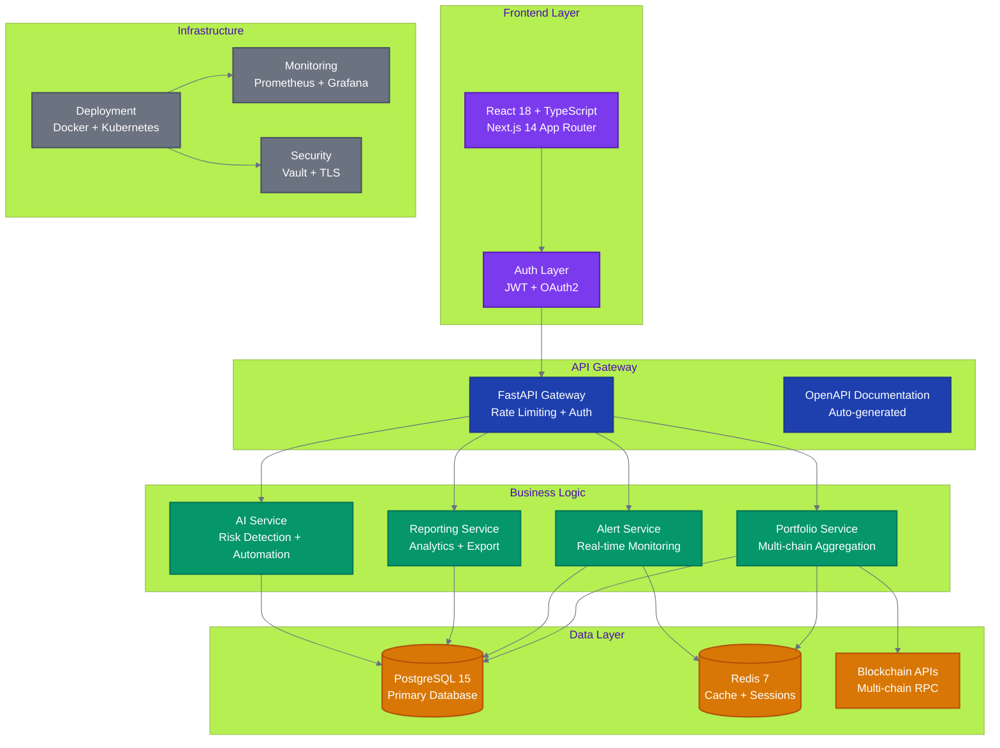
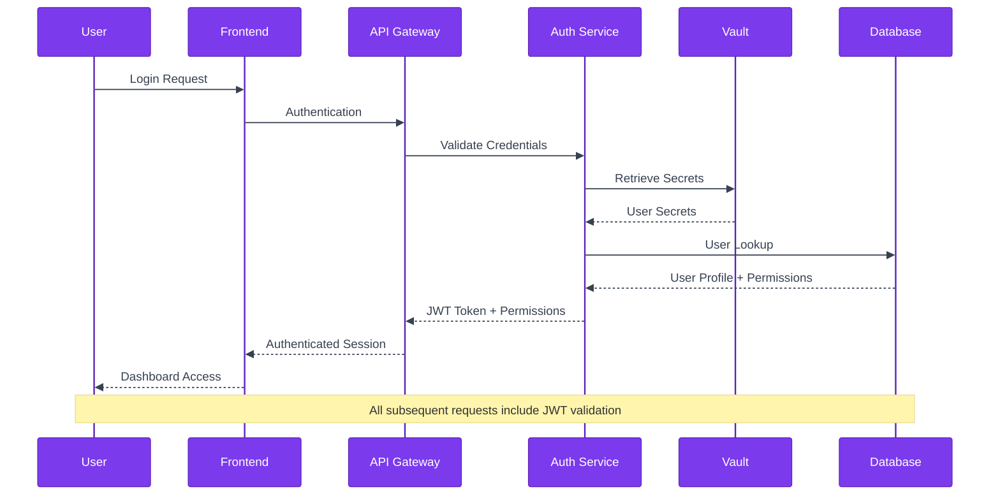

# Treasury Command Center - Technical Deep Dive

> **Comprehensive Technical Analysis** - Complete architecture, implementation details, project structure, and deployment strategies

## 🏗️ **System Architecture Overview**

Treasury Command Center is built with modern, enterprise-grade architecture designed for scalability, security, and multi-chain operations.

### **High-Level Architecture**



## 🛠️ **Technology Stack**

### **Frontend Stack**
| **Component** | **Technology** | **Version** | **Rationale** |
|---------------|----------------|-------------|---------------|
| **Framework** | Next.js | 14+ | SSR/SSG, App Router, production-ready |
| **UI Library** | React | 18+ | Industry standard, large ecosystem |
| **Language** | TypeScript | 5+ | Type safety, enhanced developer experience |
| **Styling** | Tailwind CSS | 3+ | Utility-first, highly customizable |
| **Components** | Shadcn/UI | Latest | Accessible, customizable components |
| **State Management** | Zustand + React Query | Latest | Simple state + server state management |

### **Backend Stack**
| **Component** | **Technology** | **Version** | **Rationale** |
|---------------|----------------|-------------|---------------|
| **API Framework** | FastAPI | 0.100+ | High performance, auto-documentation |
| **Language** | Python | 3.11+ | Ecosystem, AI/ML libraries, maintainability |
| **Database** | PostgreSQL | 15+ | ACID compliance, JSON support, scalability |
| **Cache/Queue** | Redis | 7+ | High performance, pub/sub, session store |
| **ORM** | SQLAlchemy | 2.0+ | Mature, flexible, migration support |
| **Authentication** | JWT + OAuth2 | Standard | Industry standard, stateless, scalable |

### **Infrastructure Stack**
| **Component** | **Technology** | **Version** | **Rationale** |
|---------------|----------------|-------------|---------------|
| **Containerization** | Docker | 24+ | Consistent environments, easy deployment |
| **Orchestration** | Kubernetes | 1.28+ | Auto-scaling, service discovery, resilience |
| **Monitoring** | Prometheus + Grafana | Latest | Industry standard, comprehensive metrics |
| **Security** | HashiCorp Vault | 1.15+ | Secret management, certificate automation |
| **CI/CD** | GitHub Actions | Latest | Integrated, flexible, cost-effective |
| **Load Balancer** | nginx/HAProxy | Latest | High performance, SSL termination |

## 🔗 **Integration Capabilities**

### **Blockchain Integration**
- **Multi-chain Support**: Ethereum, Polygon, Arbitrum, Optimism, Avalanche, BSC, Solana, Cardano
- **RPC Management**: Automatic failover, rate limiting, multiple provider support
- **Real-time Updates**: WebSocket subscriptions for immediate transaction updates
- **Custom Networks**: Easy addition of new EVM and non-EVM networks

### **API Integration**
- **RESTful API**: OpenAPI 3.0 compliant with auto-generated documentation
- **WebSocket API**: Real-time portfolio updates and alert notifications
- **Webhook Support**: Outbound notifications to external systems
- **Rate Limiting**: Configurable limits with Redis-based tracking

### **External System Integration**
- **Traditional Finance**: APIs for banking systems, accounting software
- **Identity Providers**: OAuth2 integration with Google, Microsoft, GitHub
- **Notification Systems**: Email, Slack, Discord, custom webhooks
- **Reporting Systems**: Export to Excel, PDF, CSV, direct database access

## 🔒 **Security Architecture**

### **Authentication & Authorization**


### **Security Features**
- **Zero-Trust Architecture**: Every request authenticated and authorized
- **Role-Based Access Control (RBAC)**: Granular permissions per user role
- **API Key Management**: Service-to-service authentication with rotation
- **Secret Management**: HashiCorp Vault integration for sensitive data
- **Audit Logging**: Complete audit trail for all treasury operations
- **Network Security**: TLS 1.3, certificate automation, firewall rules

### **Compliance & Standards**
- **SOC2 Type II Ready**: Architecture supports compliance requirements
- **GDPR Compliant**: Data protection and user privacy controls
- **Financial Regulations**: Audit trails and reporting for regulatory requirements
- **Industry Standards**: Following NIST cybersecurity framework

## 📊 **Performance Characteristics**

### **Scalability Metrics**
| **Component** | **Current Capacity** | **Horizontal Scaling** | **Vertical Scaling** |
|---------------|---------------------|----------------------|-------------------|
| **API Gateway** | 10K req/sec | Kubernetes auto-scaling | CPU/Memory scaling |
| **Database** | 1M+ transactions | Read replicas | PostgreSQL scaling |
| **Cache Layer** | 100K+ ops/sec | Redis Cluster | Memory scaling |
| **Blockchain APIs** | 1K+ req/sec/network | Multiple RPC providers | Provider load balancing |

### **Response Time Targets**
- **Portfolio Loading**: Under 2 seconds for complete multi-chain portfolio
- **Real-time Updates**: Under 500ms for balance updates via WebSocket
- **Report Generation**: Under 10 seconds for complex cross-chain reports
- **API Response**: Under 200ms P95 for standard API operations

### **Availability & Reliability**
- **Uptime Target**: 99.9% (8.76 hours downtime/year)
- **Recovery Time**: Under 5 minutes for service restoration
- **Data Backup**: Automated daily backups with point-in-time recovery
- **Disaster Recovery**: Multi-region deployment capability

## 🚀 **Deployment Options**

### **Cloud-Native Deployment**
```bash
# Kubernetes deployment with Helm charts
helm install treasury-command-center ./charts/treasury-command-center

# Auto-scaling configuration
kubectl apply -f k8s/autoscaling/
```

### **Docker Compose (Development)**
```bash
# Quick development setup
docker-compose up -d

# Production-ready compose
docker-compose -f docker-compose.prod.yml up -d
```

### **Hybrid Deployment**
- **Frontend**: CDN-hosted static assets (Vercel, Cloudflare)
- **Backend**: Self-hosted API services (Kubernetes, Docker)
- **Database**: Managed PostgreSQL (AWS RDS, Google Cloud SQL)
- **Cache**: Managed Redis (AWS ElastiCache, Redis Cloud)

## 🔧 **Integration Complexity Assessment**

<div style="background-color: #f0f9ff; border-left: 4px solid #0284c7; padding: 1rem; margin: 1rem 0;">

**📊 Assessment Framework**: Clear complexity tiers help estimate resources, timeline, and team requirements for your specific integration needs.

</div>

### **Low Complexity (1-2 weeks)**
- **Standard Deployment**: Using provided Docker/Kubernetes configurations
- **Basic Authentication**: OAuth2 with existing identity providers
- **Standard Networks**: Ethereum, Polygon, Arbitrum support out-of-box

> **⚡ Quick Win**: <strong style="color: #059669;">80% of organizations</strong> can achieve production deployment within the low complexity timeframe using standard configurations.

### **Medium Complexity (2-4 weeks)**
- **Custom Authentication**: Integration with enterprise SSO systems
- **Additional Networks**: Adding support for new blockchain networks
- **Custom Reporting**: Integration with existing business intelligence tools

<div style="background-color: #fefce8; border-left: 4px solid #eab308; padding: 1rem; margin: 1rem 0;">

**⚠️ Planning Note**: Medium complexity projects benefit from <strong style="color: #d97706;">dedicated DevOps support</strong> and <strong style="color: #d97706;">architecture consultation</strong> during implementation.

</div>

### **High Complexity (4-8 weeks)**
- **Enterprise Integration**: Custom APIs for legacy financial systems
- **Compliance Customization**: Custom reporting for specific regulatory requirements
- **Advanced AI**: Custom risk models and automated trading integration

<div style="background-color: #fef2f2; border-left: 4px solid #dc2626; padding: 1rem; margin: 1rem 0;">

**🏢 Enterprise Support**: High complexity implementations include <strong style="color: #dc2626;">dedicated technical consultation</strong> and <strong style="color: #dc2626;">custom development support</strong> options.

</div>

## ⚡ **Quick Technical Validation**

### **Prerequisites Check**
```bash
✅ Container Platform: Docker 24+ or Kubernetes 1.28+
✅ Database: PostgreSQL 15+ (managed or self-hosted)
✅ Cache: Redis 7+ (managed or self-hosted)
✅ Load Balancer: nginx, HAProxy, or cloud load balancer
✅ SSL/TLS: Certificate management (Let's Encrypt or custom CA)
✅ Monitoring: Prometheus/Grafana or cloud monitoring
```

### **Network Requirements**
- **Outbound HTTPS**: Access to blockchain RPC endpoints
- **Inbound HTTPS**: User access to web interface and API
- **Internal Networking**: Service-to-service communication
- **Database Access**: Secure connection to PostgreSQL and Redis

### **Security Requirements**
- **Secret Management**: HashiCorp Vault or equivalent
- **Certificate Management**: Automated certificate renewal
- **Network Security**: Firewall rules and network segmentation
- **Backup & Recovery**: Database backup strategy

## 🎯 **Technical Decision Framework**

<div style="background-color: #f7fee7; border-left: 4px solid #65a30d; padding: 1rem; margin: 1rem 0;">

**🎯 Decision Matrix**: Use this framework to objectively assess Treasury Command Center's fit for your technical environment and organizational constraints.

</div>

### **✅ Good Fit Indicators**
- **Container-native environment** (Docker/Kubernetes experience)
- **PostgreSQL expertise** in your team
- **API-first architecture** preference
- **Open-source technology** adoption
- **Multi-chain treasury requirements**

> **🚀 Strong Fit**: Organizations with <strong style="color: #059669;">3+ good fit indicators</strong> typically achieve <strong style="color: #059669;">2x faster implementation</strong> and higher user satisfaction.

### **⚠️ Considerations**
- **Team Python/TypeScript skills** (can be learned)
- **Kubernetes operational experience** (managed services available)
- **Blockchain RPC management** (multiple provider strategy needed)
- **Compliance requirements** (customization may be needed)

<div style="background-color: #fefce8; border-left: 4px solid #eab308; padding: 1rem; margin: 1rem 0;">

**📋 Mitigation Available**: Each consideration has <strong style="color: #d97706;">documented solutions</strong> and <strong style="color: #d97706;">community support resources</strong> to reduce implementation risk.

</div>

### **❌ Poor Fit Indicators**
- **Windows-only infrastructure** (Linux containers required)
- **No container platform** (significant infrastructure investment)
- **Single blockchain focus** (platform designed for multi-chain)
- **Closed-source only policy** (open-source transparency required)

<div style="background-color: #fef2f2; border-left: 4px solid #dc2626; padding: 1rem; margin: 1rem 0;">

**🚨 High Risk**: Organizations with <strong style="color: #dc2626;">2+ poor fit indicators</strong> should consider alternative solutions or significant infrastructure modernization before proceeding.

</div>

## 📁 **Project Structure**

```
treasury-command-center/
├── docs/                   # Documentation
│   ├── business/          # Business requirements & strategy
│   ├── product/           # Product specifications & PRDs
│   ├── technical/         # Technical documentation
│   ├── architecture/      # System architecture
│   ├── deployment/        # Deployment guides
│   └── api/              # API documentation
├── src/                   # Source code
│   ├── components/        # React components
│   ├── hooks/            # Custom React hooks
│   ├── services/         # API services
│   ├── utils/            # Utility functions
│   └── types/            # TypeScript types
├── working/              # Development workspace
│   ├── prototypes/       # Feature prototypes
│   ├── experiments/      # Research experiments
│   └── migrations/       # Data migrations
├── tools/                # Development tools
│   ├── scripts/          # Automation scripts
│   ├── testing/          # Testing utilities
│   ├── development/      # Dev environment setup
│   └── monitoring/       # Production monitoring
└── tests/                # Test suites
    ├── unit/             # Unit tests
    ├── integration/      # Integration tests
    ├── e2e/              # End-to-end tests
    └── performance/      # Performance tests
```

## 🏗️ **Technology Stack Details**

### **Frontend Architecture**
- **Framework**: Next.js 14 with App Router
- **UI**: React 18 + TypeScript 5
- **Styling**: Tailwind CSS 3 + Shadcn/UI
- **State Management**: Zustand + React Query
- **Authentication**: Auth0 + Internet Identity

### **Backend Architecture**
- **API Framework**: Node.js + Express + TypeScript
- **Database**: PostgreSQL 15 + Prisma ORM
- **Cache Layer**: Redis 6 + Bull Queue
- **Authentication**: JWT + OAuth2
- **Real-time**: WebSockets + Server-Sent Events

### **Infrastructure Stack**
- **Deployment**: Docker + Kubernetes
- **Monitoring**: Prometheus + Grafana + Jaeger
- **CI/CD**: GitHub Actions + GitOps
- **Security**: HashiCorp Vault + SSL/TLS
- **Observability**: OpenTelemetry + Logs aggregation

## 🛣️ **Development Roadmap**

### **Phase 1: Foundation (Q3 2025)**
- ✅ Unified authentication and dashboard
- ✅ Multi-chain portfolio tracking
- ✅ Basic stablecoin monitoring
- ✅ Core alerting system
- ✅ API-first architecture

### **Phase 2: Intelligence (Q4 2025)**
- 🔄 AI agent automation
- 🔄 Advanced analytics and reporting
- 🔄 Market intelligence integration
- 🔄 Compliance reporting automation
- 🔄 Real-time risk monitoring

### **Phase 3: Scale (Q1 2026)**
- 📋 Enterprise features and white-labeling
- 📋 Additional blockchain integrations
- 📋 DeFi protocol monitoring
- 📋 Institutional trading integration
- 📋 Advanced AI/ML capabilities

## 🚀 **Your Next Technical Steps**

> **Based on your technical evaluation, choose your immediate next action:**

### **🔬 Immediate Validation (Choose One)**

<table>
<tr>
<td width="33%" align="center">
<h4>⚡ <strong>Hands-On Trial</strong></h4>
<p><strong><a href="../getting-started/QUICK_START.md">Quick Start Guide</a></strong></p>
<p><em>Deploy locally in 15 minutes</em></p>
<ul align="left">
<li>Validate environment compatibility</li>
<li>Test core functionality</li>
<li>Assess integration complexity</li>
</ul>
</td>
<td width="33%" align="center">
<h4>🏗️ <strong>Architecture Deep Dive</strong></h4>
<p><strong><a href="ARCHITECTURE_OVERVIEW.md">System Architecture</a></strong></p>
<p><em>Complete technical analysis</em></p>
<ul align="left">
<li>Understand system components</li>
<li>Review scalability design</li>
<li>Assess integration points</li>
</ul>
</td>
<td width="33%" align="center">
<h4>🔒 <strong>Security Validation</strong></h4>
<p><strong><a href="../security/SECURITY_ASSESSMENT.md">Security Deep Dive</a></strong></p>
<p><em>Enterprise security evaluation</em></p>
<ul align="left">
<li>Review security architecture</li>
<li>Validate compliance features</li>
<li>Assess enterprise readiness</li>
</ul>
</td>
</tr>
</table>

### **🛠️ Implementation Planning**

**If technical evaluation is positive:**

1. **📋 [Development Environment](../developers/DEVELOPMENT_SETUP.md)** - *Set up complete dev environment with testing framework* (30 min)
2. **🚀 [Production Planning](../deployment/PRODUCTION_DEPLOYMENT.md)** - *Plan enterprise deployment with monitoring* (1 hour)
3. **🔗 [Integration Strategy](../integration/blockchain/MULTI_CHAIN_SETUP.md)** - *Design multi-chain integration approach* (45 min)

### **💼 Business Stakeholder Alignment**

**Share with your business team:**

1. **💰 [Business Value Summary](../business/BUSINESS_VALUE_OVERVIEW.md)** - *Executive summary with ROI analysis* (3 min read)
2. **📊 [Technical Recommendation](TECHNICAL_RECOMMENDATION_TEMPLATE.md)** - *Template for your technical assessment* (Fill out)
3. **🎯 [Pilot Program Proposal](../business/PILOT_PROGRAM.md)** - *Structured pilot approach with success metrics* (5 min read)

---

## 🔗 **Related Technical Resources**

### **📚 Deep Technical Documentation**
- **[Multi-Chain Integration](../integration/blockchain/MULTI_CHAIN_SETUP.md)** - *Blockchain network configuration and management*
- **[API Reference](../api/README.md)** - *Complete API documentation with examples*
- **[Performance & Monitoring](../deployment/PRODUCTION_DEPLOYMENT.md#monitoring-stack)** - *Production monitoring and observability*

### **🛡️ Security & Compliance**
- **[Security Architecture](../security/SECURITY_OVERVIEW.md)** - *Zero-trust security model and implementation*
- **[Compliance Framework](../compliance/COMPLIANCE_OVERVIEW.md)** - *Regulatory compliance and audit support*
- **[Disaster Recovery](../deployment/DISASTER_RECOVERY.md)** - *Business continuity and backup strategies*

### **🚀 Advanced Implementation**
- **[Performance Tuning](../advanced/PERFORMANCE_OPTIMIZATION.md)** - *Optimize for high-volume treasury operations*
- **[Custom Extensions](../advanced/CUSTOM_DEVELOPMENT.md)** - *Extend platform for specific requirements*
- **[Enterprise Integration](../enterprise/ENTERPRISE_INTEGRATION.md)** - *Integrate with existing financial systems*

---

**Technical Assessment Summary**: Treasury Command Center uses modern, enterprise-grade technology stack with proven scalability, security, and integration capabilities. The architecture supports both cloud-native and hybrid deployments with comprehensive monitoring and compliance features.

**Recommendation**: Proceed with hands-on evaluation using the Quick Start Guide to validate technical fit in your environment.

---

*Last Updated: July 18, 2025*  
*Document Type: Technical Evaluation*  
*Reading Time: 5 minutes*