# Getting Started Tutorial

Step-by-step tutorial for new users to get up and running with Treasury Command Center.

## 🎯 What You'll Learn

By the end of this tutorial, you'll be able to:
- Set up your Treasury Command Center account
- Add wallets from multiple blockchain networks
- Monitor your portfolio in real-time
- Set up alerts for important changes
- Generate basic reports

**Estimated Time**: 30 minutes  
**Difficulty**: Beginner  
**Prerequisites**: Basic knowledge of cryptocurrency wallets

## 🗺️ Complete User Journey Overview

### End-to-End User Onboarding Flow


## 📋 Before We Start

### What You'll Need
- A computer with internet access
- At least one cryptocurrency wallet address
- Basic understanding of blockchain networks
- 15-30 minutes of uninterrupted time

### Supported Networks
For this tutorial, we'll focus on these beginner-friendly networks:
- **Ethereum** - Most popular smart contract platform
- **Polygon** - Fast and low-cost Ethereum scaling solution
- **Arbitrum** - Ethereum Layer 2 for reduced fees

## 🚀 Step 1: Access Treasury Command Center

### Option A: Online Version (Recommended for Beginners)
1. Navigate to https://app.treasury-command-center.com
2. Click "Get Started" on the homepage

### Option B: Self-Hosted Version
1. Follow our [Quick Start Guide](../../getting-started/QUICK_START.md)
2. Access your local instance at http://localhost:3000

---

## 👤 Step 2: Create Your Account

### 2.1 Registration Process
1. Click "Sign Up" in the top-right corner
2. Fill out the registration form:
   ```
   Email: your-email@example.com
   Password: [Create a strong password]
   Confirm Password: [Repeat your password]
   Organization: [Optional - your company name]
   ```
3. Click "Create Account"

### 2.2 Email Verification
1. Check your email for a verification message
2. Click the verification link
3. You'll be redirected back to Treasury Command Center

### 2.3 Initial Setup
1. Log in with your new credentials
2. Complete the welcome survey (optional but helpful)
3. You'll see your empty dashboard

**🎉 Congratulations! Your account is ready.**

---

## 💰 Step 3: Add Your First Wallet

### Wallet Addition Process Flow

```mermaid
%%{init: {
  'theme': 'base',
  'themeVariables': {
    'primaryColor': '#7C3AED',
    'primaryTextColor': '#FFFFFF',
    'primaryBorderColor': '#5B21B6',
    'lineColor': '#6B7280',
    'sectionColor': '#F3F0FF',
    'textColor': '#374151'
  }
}}%%
flowchart TD
    subgraph "User Dashboard"
        START[User Lands on Dashboard]
        EMPTY_STATE[Empty Portfolio State<br/>🏦 "Add your first wallet"]
        ADD_WALLET_BTN[Click "Add Wallet" Button]
    end
    
    subgraph "Wallet Form Interface"
        FORM_OPEN[Wallet Addition Form Opens]
        NETWORK_SELECT[Select Blockchain Network<br/>📋 Dropdown Menu]
        ADDRESS_INPUT[Enter Wallet Address<br/>📝 Text Input with Validation]
        LABEL_INPUT[Add Wallet Label<br/>🏷️ Descriptive Name]
        DESCRIPTION[Add Description<br/>📄 Optional Details]
    end
    
    subgraph "Validation & Verification"
        ADDRESS_VALIDATE{Validate Address Format}
        NETWORK_CHECK{Network Compatibility Check}
        DUPLICATE_CHECK{Duplicate Wallet Check}
        FORM_VALIDATE{All Fields Valid?}
    end
    
    subgraph "System Processing"
        SAVE_WALLET[Save Wallet to Database]
        INIT_BALANCE[Initialize Balance Fetching]
        BLOCKCHAIN_QUERY[Query Blockchain APIs<br/>⛓️ RPC Calls]
        TOKEN_DISCOVERY[Discover Token Holdings<br/>🔍 ERC-20/SPL Tokens]
    end
    
    subgraph "Data Loading States"
        LOADING_STATE[Show Loading Animation<br/>⏳ "Fetching balances..."]
        BALANCE_FETCH[Fetch Native Token Balance]
        TOKEN_FETCH[Fetch Token Balances]
        PRICE_FETCH[Fetch Current Prices<br/>💰 USD Values]
    end
    
    subgraph "Success & Display"
        WALLET_ADDED[✅ Wallet Successfully Added]
        BALANCE_DISPLAY[Display Balances & Values]
        PORTFOLIO_UPDATE[Update Portfolio Totals]
        SUCCESS_MESSAGE[Show Success Notification]
    end
    
    subgraph "Error Handling"
        INVALID_ADDRESS[❌ Invalid Address Format]
        NETWORK_ERROR[❌ Network Connection Error]
        DUPLICATE_ERROR[❌ Wallet Already Added]
        API_ERROR[❌ Blockchain API Error]
        RETRY_OPTION[Offer Retry Options]
    end
    
    %% Main flow
    START --> EMPTY_STATE
    EMPTY_STATE --> ADD_WALLET_BTN
    ADD_WALLET_BTN --> FORM_OPEN
    
    %% Form completion
    FORM_OPEN --> NETWORK_SELECT
    NETWORK_SELECT --> ADDRESS_INPUT
    ADDRESS_INPUT --> LABEL_INPUT
    LABEL_INPUT --> DESCRIPTION
    
    %% Validation flow
    DESCRIPTION --> ADDRESS_VALIDATE
    ADDRESS_VALIDATE -->|Valid| NETWORK_CHECK
    ADDRESS_VALIDATE -->|Invalid| INVALID_ADDRESS
    
    NETWORK_CHECK -->|Compatible| DUPLICATE_CHECK
    NETWORK_CHECK -->|Incompatible| NETWORK_ERROR
    
    DUPLICATE_CHECK -->|Unique| FORM_VALIDATE
    DUPLICATE_CHECK -->|Duplicate| DUPLICATE_ERROR
    
    FORM_VALIDATE -->|Valid| SAVE_WALLET
    FORM_VALIDATE -->|Invalid| FORM_OPEN
    
    %% System processing
    SAVE_WALLET --> INIT_BALANCE
    INIT_BALANCE --> LOADING_STATE
    LOADING_STATE --> BLOCKCHAIN_QUERY
    
    %% Data fetching
    BLOCKCHAIN_QUERY --> BALANCE_FETCH
    BLOCKCHAIN_QUERY --> TOKEN_DISCOVERY
    BALANCE_FETCH --> TOKEN_FETCH
    TOKEN_DISCOVERY --> TOKEN_FETCH
    TOKEN_FETCH --> PRICE_FETCH
    
    %% Success path
    PRICE_FETCH --> WALLET_ADDED
    WALLET_ADDED --> BALANCE_DISPLAY
    BALANCE_DISPLAY --> PORTFOLIO_UPDATE
    PORTFOLIO_UPDATE --> SUCCESS_MESSAGE
    
    %% Error handling
    INVALID_ADDRESS --> RETRY_OPTION
    NETWORK_ERROR --> RETRY_OPTION
    DUPLICATE_ERROR --> RETRY_OPTION
    BLOCKCHAIN_QUERY -->|API Error| API_ERROR
    API_ERROR --> RETRY_OPTION
    RETRY_OPTION --> FORM_OPEN
    
    %% Loop back for additional wallets
    SUCCESS_MESSAGE -.->|Add Another| ADD_WALLET_BTN
    
    %% Styling
    classDef dashboard fill:#F3F0FF,stroke:#7C3AED,stroke-width:2px
    classDef form fill:#7C3AED,color:#FFFFFF,stroke:#5B21B6,stroke-width:2px
    classDef validation fill:#1E40AF,color:#FFFFFF,stroke:#1E3A8A,stroke-width:2px
    classDef processing fill:#059669,color:#FFFFFF,stroke:#047857,stroke-width:2px
    classDef loading fill:#D97706,color:#FFFFFF,stroke:#B45309,stroke-width:2px
    classDef success fill:#059669,color:#FFFFFF,stroke:#047857,stroke-width:2px
    classDef error fill:#DC2626,color:#FFFFFF,stroke:#B91C1C,stroke-width:2px
    classDef decision fill:#F3F0FF,stroke:#7C3AED,stroke-width:2px
    
    class START,EMPTY_STATE,ADD_WALLET_BTN dashboard
    class FORM_OPEN,NETWORK_SELECT,ADDRESS_INPUT,LABEL_INPUT,DESCRIPTION form
    class SAVE_WALLET,INIT_BALANCE,BLOCKCHAIN_QUERY,TOKEN_DISCOVERY processing
    class LOADING_STATE,BALANCE_FETCH,TOKEN_FETCH,PRICE_FETCH loading
    class WALLET_ADDED,BALANCE_DISPLAY,PORTFOLIO_UPDATE,SUCCESS_MESSAGE success
    class INVALID_ADDRESS,NETWORK_ERROR,DUPLICATE_ERROR,API_ERROR,RETRY_OPTION error
    class ADDRESS_VALIDATE,NETWORK_CHECK,DUPLICATE_CHECK,FORM_VALIDATE decision
```

### 3.1 Navigate to Wallet Management
1. Click "Add Wallet" button on your dashboard
2. Or go to "Wallets" in the main navigation

### 3.2 Add an Ethereum Wallet
1. Select "Ethereum" from the network dropdown
2. Enter your wallet details:
   ```
   Network: Ethereum
   Address: 0x742d35Cc6634C0532925a3b8D42C81Da2b78D8d9
   Label: My Main Ethereum Wallet
   Description: Primary treasury wallet for ETH and tokens
   ```
3. Click "Add Wallet"

### 3.3 Verify Wallet Addition
- Your wallet will appear in the wallets list
- Balance data will start loading (may take 30-60 seconds)
- You'll see native ETH balance and any ERC-20 tokens

### 3.4 Add Additional Wallets (Optional)
Repeat the process for other networks:

**Polygon Wallet Example:**
```
Network: Polygon
Address: 0x742d35Cc6634C0532925a3b8D42C81Da2b78D8d9
Label: Polygon Operations Wallet
Description: Wallet for DeFi operations on Polygon
```

**Arbitrum Wallet Example:**
```
Network: Arbitrum One
Address: 0x742d35Cc6634C0532925a3b8D42C81Da2b78D8d9
Label: Arbitrum Trading Wallet
Description: Low-fee trading operations
```

---

## 📊 Step 4: Explore Your Dashboard

### 4.1 Portfolio Overview
After adding wallets, your dashboard will show:

1. **Total Portfolio Value**
   - Aggregated value across all networks
   - Updated in real-time
   
2. **Network Breakdown**
   - Value per blockchain network
   - Percentage allocation

3. **Top Holdings**
   - Your largest token positions
   - Current values and 24h changes

### 4.2 Understanding the Interface

#### Balance Cards
Each wallet shows:
- **Native Token Balance**: ETH, MATIC, etc.
- **Token Holdings**: ERC-20, SPL tokens, etc.
- **USD Values**: Real-time pricing
- **24h Changes**: Price movements

#### Quick Actions
- **Refresh**: Update balances manually
- **Export**: Download balance data
- **Settings**: Configure wallet preferences

### 4.3 Real-Time Updates
- Balances update automatically every 5 minutes
- Price data updates every 30 seconds
- New transactions appear within 1-2 minutes

---

## 🔔 Step 5: Set Up Your First Alert

Alerts help you stay informed about important changes.

### Alert Configuration Workflow

```mermaid
%%{init: {
  'theme': 'base',
  'themeVariables': {
    'primaryColor': '#7C3AED',
    'primaryTextColor': '#FFFFFF',
    'primaryBorderColor': '#5B21B6',
    'lineColor': '#6B7280',
    'sectionColor': '#F3F0FF',
    'textColor': '#374151'
  }
}}%%
sequenceDiagram
    participant U as User
    participant UI as Web Interface
    participant API as Alert Service
    participant DB as Database
    participant MONITOR as Monitoring System
    participant NOTIFY as Notification Service
    
    Note over U,NOTIFY: Alert Creation Process
    
    U->>UI: Navigate to Alerts Page
    UI->>API: GET /api/v1/alerts
    API->>DB: Fetch existing alerts
    DB-->>API: Return alert list
    API-->>UI: Display alerts dashboard
    UI-->>U: Show current alerts
    
    Note over U,NOTIFY: Creating New Alert
    
    U->>UI: Click "Create Alert"
    UI->>UI: Open alert form modal
    UI-->>U: Display alert type options<br/>Balance, Price, Transaction
    
    U->>UI: Select "Balance Threshold"
    UI->>API: GET /api/v1/wallets
    API->>DB: Fetch user wallets
    DB-->>API: Return wallet list
    API-->>UI: Populate wallet dropdown
    UI-->>U: Show wallet selection
    
    U->>UI: Configure alert parameters<br/>Wallet: Main ETH<br/>Condition: Below<br/>Threshold: 1 ETH
    U->>UI: Select notification methods<br/>Email + Dashboard
    U->>UI: Click "Save Alert"
    
    Note over U,NOTIFY: Alert Validation & Storage
    
    UI->>API: POST /api/v1/alerts<br/>{type, wallet, condition, threshold, notifications}
    API->>API: Validate alert parameters<br/>Check thresholds & permissions
    
    alt Valid Alert Configuration
        API->>DB: INSERT alert record
        DB-->>API: Confirm alert saved
        API->>MONITOR: Register new alert<br/>Add to monitoring queue
        MONITOR-->>API: Confirm registration
        API-->>UI: 201 Created + alert details
        UI-->>U: Success: "Alert created successfully"
        
        Note over U,NOTIFY: Alert Monitoring Cycle
        
        loop Every 30 seconds
            MONITOR->>API: Check wallet balance<br/>via blockchain APIs
            API->>API: Compare with threshold<br/>1.5 ETH current vs 1.0 ETH threshold
            
            alt Threshold NOT Breached
                API-->>MONITOR: No action needed
            else Threshold Breached
                API->>NOTIFY: Trigger alert notification<br/>Balance: 0.8 ETH (below 1.0 ETH)
                NOTIFY->>NOTIFY: Send email notification
                NOTIFY->>UI: Send dashboard notification
                NOTIFY->>DB: Log alert trigger event
                NOTIFY-->>API: Notification sent
                
                Note over U,NOTIFY: User Receives Alert
                
                NOTIFY-->>U: 📧 Email: "Balance Alert Triggered"
                UI-->>U: 🔔 Dashboard: Alert notification
                
                U->>UI: Click notification
                UI->>API: GET /api/v1/alerts/{id}/history
                API->>DB: Fetch alert history
                DB-->>API: Return trigger events
                API-->>UI: Display alert details
                UI-->>U: Show alert history & current status
            end
        end
        
    else Invalid Alert Configuration
        API-->>UI: 400 Bad Request<br/>{error: "Invalid threshold"}
        UI-->>U: Error: "Please check alert parameters"
        U->>UI: Modify alert settings
    end
    
    Note over U,NOTIFY: Alert Management
    
    U->>UI: View "Alert History"
    UI->>API: GET /api/v1/alerts/{id}/triggers
    API->>DB: Fetch trigger history
    DB-->>API: Return events with timestamps
    API-->>UI: Format alert timeline
    UI-->>U: Display alert activity log
    
    U->>UI: Modify alert settings
    UI->>API: PUT /api/v1/alerts/{id}
    API->>DB: Update alert configuration
    API->>MONITOR: Update monitoring parameters
    API-->>UI: Alert updated successfully
    UI-->>U: Confirmation message
```



### 5.1 Create a Balance Alert
1. Go to "Alerts" in the main navigation
2. Click "Create Alert"
3. Configure your alert:
   ```
   Alert Type: Balance Threshold
   Wallet: My Main Ethereum Wallet
   Condition: When balance falls below
   Threshold: 1 ETH
   Notification: Email + Dashboard
   ```
4. Click "Save Alert"

### 5.2 Create a Price Alert
1. Click "Create Alert" again
2. Set up a price-based alert:
   ```
   Alert Type: Price Change
   Token: Ethereum (ETH)
   Condition: When price changes by more than
   Threshold: 5%
   Time Period: 1 hour
   Notification: Email
   ```
3. Click "Save Alert"

### 5.3 Test Your Alerts
- Alerts will trigger based on real market conditions
- You can test by setting temporary low thresholds
- Check "Alert History" to see past notifications

---

## 📈 Step 6: Generate Your First Report

### 6.1 Basic Portfolio Report
1. Navigate to "Reports" section
2. Click "Generate Report"
3. Select "Portfolio Summary" report type
4. Choose date range: "Last 30 days"
5. Click "Generate"

### 6.2 Understanding Your Report
The report will include:
- **Portfolio Performance**: Gains/losses over time
- **Asset Allocation**: Distribution across tokens
- **Network Analysis**: Performance by blockchain
- **Transaction Summary**: Activity overview

### 6.3 Export and Share
1. Click "Export" to download as PDF or CSV
2. Use "Share" to generate a read-only link
3. Reports are saved in your account for future reference

---

## 🔧 Step 7: Customize Your Experience

### 7.1 Dashboard Preferences
1. Go to "Settings" → "Dashboard"
2. Customize:
   - Default currency (USD, EUR, etc.)
   - Refresh intervals
   - Widget layout
   - Color themes

### 7.2 Notification Settings
1. Go to "Settings" → "Notifications"
2. Configure:
   - Email frequency
   - Alert types
   - Slack/Discord integration
   - Mobile notifications (if app available)

### 7.3 Privacy Settings
1. Go to "Settings" → "Privacy"
2. Control:
   - Data sharing preferences
   - Public portfolio visibility
   - Analytics participation

---

## 🔍 Step 8: Advanced Features Preview

Now that you're set up, explore these advanced features:

### 8.1 Analytics Dashboard
- Deep dive into portfolio performance
- Compare against market indices
- Risk analysis and recommendations

### 8.2 DeFi Protocol Integration
- Track positions in Uniswap, Aave, Compound
- Monitor yield farming rewards
- DeFi portfolio analysis

### 8.3 API Access
- Generate API keys for programmatic access
- Build custom integrations
- Automate reporting workflows

---

## ✅ Tutorial Checklist

Mark off each item as you complete it:

- [ ] Created Treasury Command Center account
- [ ] Verified email address
- [ ] Added first wallet (Ethereum)
- [ ] Added second wallet (different network)
- [ ] Explored portfolio dashboard
- [ ] Set up balance alert
- [ ] Set up price alert
- [ ] Generated portfolio report
- [ ] Customized dashboard settings
- [ ] Configured notification preferences

**🎉 Congratulations! You've completed the basic setup.**

---

## 🆘 Need Help?

### Common Issues

**Problem**: Wallet not showing balances
- **Solution**: Check that the address is correct and the network is supported
- **Tip**: It can take 1-2 minutes for initial data to load

**Problem**: Alerts not triggering
- **Solution**: Verify your notification settings and email preferences
- **Tip**: Check spam folder for alert emails

**Problem**: Incorrect portfolio value
- **Solution**: Refresh the page or click "Sync Balances"
- **Tip**: Price data may have a 1-2 minute delay

### Getting Support

1. **Help Center**: Check our [FAQ](../../getting-started/FAQ.md)
2. **Community Discord**: [Join our community](https://discord.gg/treasury-command-center)
3. **Email Support**: support@treasury-command-center.com
4. **GitHub Issues**: [Report bugs](https://github.com/lamassu-labs/treasury-command-center/issues)

---

## 🚀 What's Next?

### Recommended Next Steps

1. **[Advanced Portfolio Management](../advanced/PORTFOLIO_OPTIMIZATION.md)**
   - Learn portfolio rebalancing strategies
   - Set up automated reporting
   - Configure advanced alerts

2. **[DeFi Integration Tutorial](../advanced/DEFI_INTEGRATION.md)**
   - Connect DeFi protocols
   - Track yield farming positions
   - Monitor liquidity pool performance

3. **[API Integration Guide](../../integration/api/)**
   - Generate API keys
   - Build custom dashboards
   - Automate treasury operations

4. **[Security Best Practices](../advanced/SECURITY_GUIDE.md)**
   - Secure your account
   - Enable two-factor authentication
   - Wallet security recommendations

### Join the Community

- **Discord**: [Treasury Command Center Community](https://discord.gg/treasury-command-center)
- **Twitter**: [@TreasuryCC](https://twitter.com/treasurycc)
- **GitHub**: [Contribute to the project](https://github.com/lamassu-labs/treasury-command-center)
- **Newsletter**: [Subscribe for updates](https://treasury-command-center.com/newsletter)

---

**Tutorial Complete!** 🎊

You now have a fully functional Treasury Command Center setup. Continue exploring the platform to discover more powerful features for managing your multi-chain treasury operations.

**Questions?** Join our [Discord community](https://discord.gg/treasury-command-center) where our team and community members are happy to help!

---

**Last Updated**: July 17, 2025  
**Tutorial Version**: 1.0  
**Estimated Completion Time**: 30 minutes